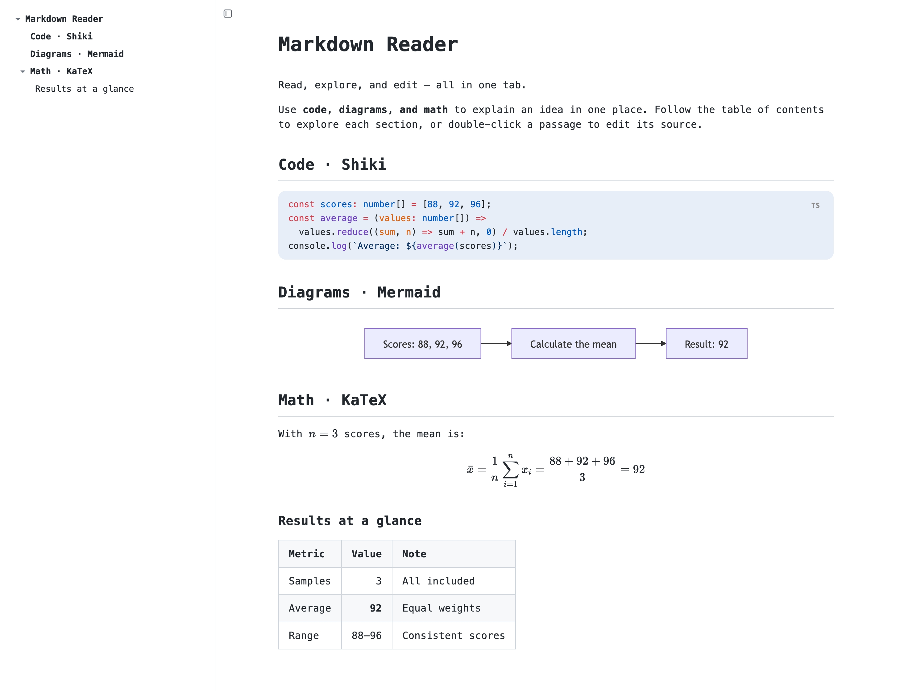

# Markdown Reader

> Read Markdown in VS Code with a synchronized table of contents, Shiki code highlighting, Mermaid diagrams, and KaTeX math — all in one tab, all offline.

[中文文档](README.zh-CN.md) · [GitHub repository](https://github.com/ytcheng/vscode-markdown-reader)



Markdown Reader turns Markdown files into focused, document-style reading views without leaving your current editor tab. It is designed for people who read long specifications, notes, documentation, and AI-generated Markdown in VS Code.

## Highlights

- **Read in the current tab** — open Markdown as a clean document instead of a source file or a forced side-by-side preview.
- **Synchronized table of contents** — headings become a navigable TOC that follows your reading position.
- **Stay oriented after changes** — refreshes when the file changes and restores your reading position where possible.
- **Source and Preview, one shortcut** — switch in either direction with <kbd>Ctrl</kbd>/<kbd>Cmd</kbd> + <kbd>Shift</kbd> + <kbd>V</kbd>.
- **Find in the document** — use <kbd>Ctrl</kbd>/<kbd>Cmd</kbd> + <kbd>F</kbd> to search, highlight results, and move between matches.
- **Shiki code highlighting** — TextMate grammars, language labels, and copy buttons; unknown languages remain readable plain text.
- **Diagrams and math, offline** — Mermaid fenced diagrams and KaTeX inline/block formulas render with bundled resources.
- **Edit what you read** — double-click body text or click the **pencil icon** beside a heading to open its source line in the same editor group.
- **Copy heading links** — use **#** beside a heading to copy its encoded `#fragment` for links within that document.
- **Remember your TOC** — visibility and collapsed branches survive closing/reopening a document, independently for each document in the workspace.
- **Fits your layout** — show or hide the TOC, resize it, choose its heading depth, and set a preferred reading width.
- **Several documents at once** — each Markdown file gets its own independent reader tab.

## Getting started

1. Install **Markdown Reader** from the VS Code Marketplace.
2. Open any `.md` file. Markdown Reader is registered as the default reading editor for Markdown files.
3. If VS Code opens the text editor instead, choose **Reopen Editor With…** from the editor title menu, then select **Markdown Reader**.

### Switch between reading and editing

| What you want to do | How |
| --- | --- |
| Open the reading view | Run **Markdown Reader: Open Preview** |
| Return to the Markdown source | Run **Markdown Reader: Open Source** |
| Edit a specific passage | Double-click the passage, or click a heading’s pencil icon |
| Copy a heading link | Click **#** beside the heading |
| Toggle Source / Preview | <kbd>Ctrl</kbd>/<kbd>Cmd</kbd> + <kbd>Shift</kbd> + <kbd>V</kbd> |
| Show or hide the table of contents | Run **Markdown Reader: Toggle Table of Contents** |
| Search the rendered document | <kbd>Ctrl</kbd>/<kbd>Cmd</kbd> + <kbd>F</kbd> |

All commands are also available from the Command Palette (`Ctrl`/`Cmd` + `Shift` + `P`) under **Markdown Reader**.

## Configuration

Configure Markdown Reader in VS Code Settings, or add the following to `settings.json`:

```json
{
  "markdownReader.toc.enabled": true,
  "markdownReader.toc.maxDepth": 3,
  "markdownReader.toc.width": 260,
  "markdownReader.content.maxWidth": 900
}
```

| Setting | Default | Description |
| --- | ---: | --- |
| `markdownReader.toc.enabled` | `true` | Show the table of contents when opening a document. |
| `markdownReader.toc.maxDepth` | `3` | Include headings through this level (`1`–`6`). |
| `markdownReader.toc.width` | `260` | Default TOC width in pixels (`180`–`480`). You can also resize it in the reader. |
| `markdownReader.content.maxWidth` | `900` | Maximum reading-column width in pixels (`560`–`1600`). |

## Markdown support

Markdown Reader supports the everyday Markdown features needed for documentation and notes:

- CommonMark basics: headings, paragraphs, emphasis, lists, block quotes, code, and horizontal rules
- Tables, task lists, strikethrough, autolinks, and fenced code blocks
- Local and HTTPS images
- In-document anchors, Markdown file links, and external web links

Use fenced blocks labelled `mermaid` for diagrams, `$...$` for inline math, and `$$...$$` for display math. Invalid diagrams retain their source with an error message; invalid formulas remain readable. All grammars, diagram code, fonts, and styles are bundled for offline use. Diagrams and formulas render locally without uploading document content or requiring an API key.

Source navigation targets the beginning of the clicked Markdown block. Links, buttons, and form controls keep their normal behavior. TOC state is remembered for the most recent 100 document URIs in each workspace; existing split previews remain independent. `toc.enabled` sets the default for documents without saved state.

Raw Markdown HTML remains disabled. Diagrams are rendered in a sandboxed local frame and displayed as non-interactive SVG images. Generated heading controls are excluded from search; diagram and formula internals are not searched.

## Safety and link handling

For safety, external links are limited to `https:`, `http:`, and `mailto:`. Other schemes are blocked. Local images are loaded only from the workspace root, or from the document directory when the file is outside a workspace.

## Development

```bash
npm install
npm run check
```

## License

[MIT](LICENSE)
