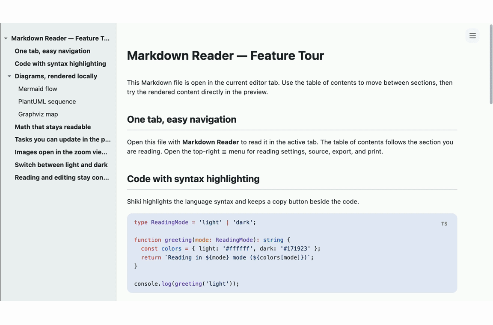
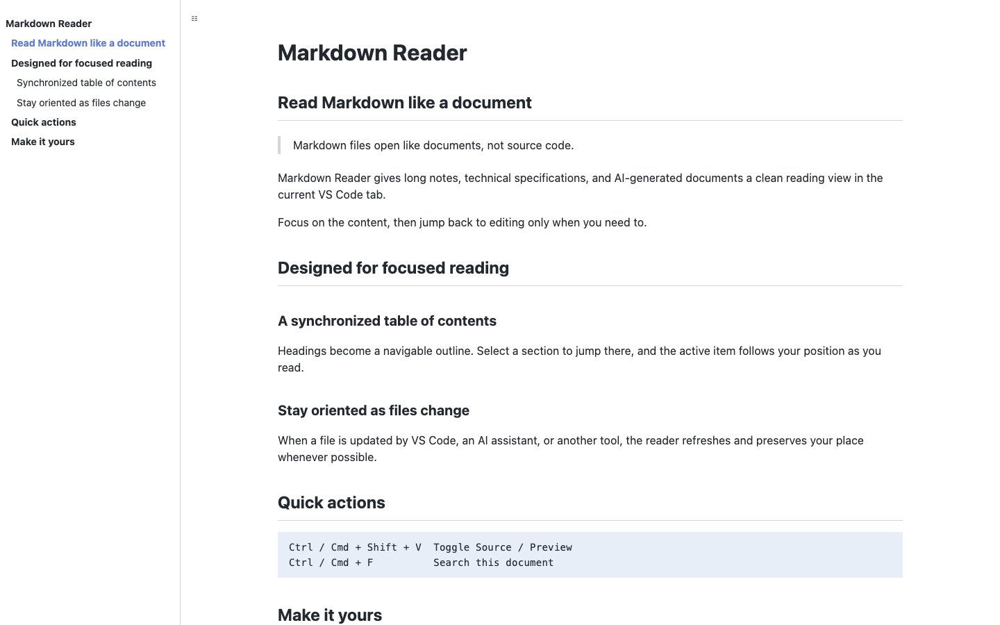
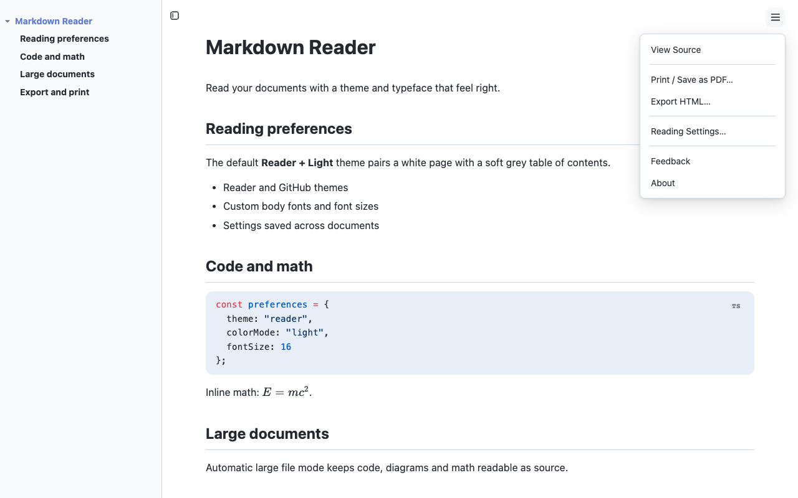
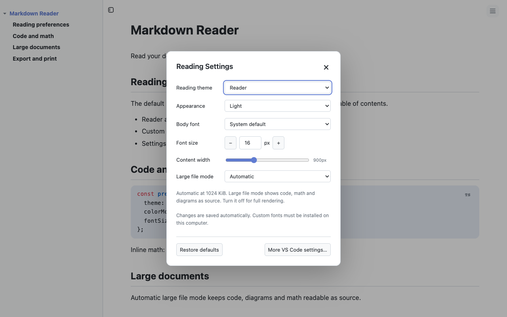
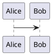
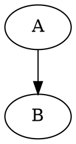
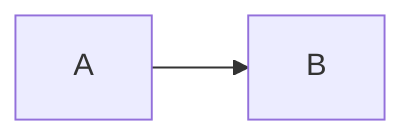

# Markdown Reader

**Read Markdown like a document, right in your current VS Code tab.**

A focused reading view for long documents, with a synchronized table of contents, highlighted code, Mermaid, PlantUML and Graphviz diagrams, and math. Great for specs, READMEs, plans, and AI-generated notes.



**Current-tab reading · Synchronized table of contents · Code, diagrams, and math**

[Install from the VS Code Marketplace](https://marketplace.visualstudio.com/items?itemName=chengjian.vscode-markdown-reader) · [中文文档](README.zh-CN.md) · [GitHub repository](https://github.com/ytcheng/vscode-markdown-reader)

## Highlights



- **Read in the current tab** — open Markdown as a clean document instead of a source file or a forced side-by-side preview.
- **Synchronized table of contents** — headings become a navigable TOC that follows your reading position.
- **Navigate with a synchronized table of contents** — headings form a navigable TOC that follows your reading position.
- **Read code, diagrams, and math in context** — Shiki highlights code with language labels and copy buttons; Mermaid, PlantUML, and Graphviz diagrams plus KaTeX formulas render locally with bundled resources. Unknown code languages remain readable as plain text.
- **Interact with task lists** — check or uncheck Markdown tasks directly in the preview; the source document updates with your change.
- **Zoom diagrams and images** — click a Mermaid, PlantUML, or Graphviz diagram, or any standalone Markdown image, to open the full-preview viewer. Use the zoom controls and drag to pan; linked images keep their link behavior. Keyboard users can focus a diagram and press Enter or Space.
- **Move from reading to editing** — switch Source and Preview with <kbd>Ctrl</kbd>/<kbd>Cmd</kbd> + <kbd>Shift</kbd> + <kbd>V</kbd>, select body text and click the pencil, or use the **pencil icon** beside a heading to open its source line in the same editor group.
- **Find and link to content** — search with <kbd>Ctrl</kbd>/<kbd>Cmd</kbd> + <kbd>F</kbd>; use **#** beside a heading to copy its encoded `#fragment`.
- **Choose the reading appearance** — Reader / GitHub themes, light / dark / follow-VS-Code colors, local body fonts, and 12–32 px text.
- **Keep your place** — the preview refreshes when the file changes and restores your reading position where possible. TOC visibility and collapsed branches are remembered per document.
- **Fit the reader to your work** — show, hide, and resize the TOC, choose its heading depth and reading width, and keep separate reader tabs for separate documents. Diffs continue to use VS Code's text diff editor.
- **Export and print** — save HTML with embedded local resources, or print and save PDF through your browser.
- **Read large documents** — large file mode can show code, math, and diagrams as source to reduce rendering work.
- **Use your preferred interface language** — follow VS Code by default, or select English or Simplified Chinese in Reading Settings.

## Getting started

1. Install [**Markdown Reader: Focus Mode**](https://marketplace.visualstudio.com/items?itemName=chengjian.vscode-markdown-reader) from the VS Code Marketplace.
2. Open any `.md` file. Markdown Reader is registered as the default reading editor for Markdown files.
3. If VS Code opens the text editor instead, choose **Reopen Editor With…** from the editor title menu, then select **Markdown Reader**.

### Switch between reading and editing

| What you want to do | How |
| --- | --- |
| Open the reading view | Run **Markdown Reader: Open Preview** |
| Return to the Markdown source | Run **Markdown Reader: Open Source** |
| Edit a specific passage | Select text and click the pencil above its end, or click a heading’s pencil icon |
| Copy a heading link | Click **#** beside the heading |
| Toggle Source / Preview | <kbd>Ctrl</kbd>/<kbd>Cmd</kbd> + <kbd>Shift</kbd> + <kbd>V</kbd> |
| Show or hide the table of contents | Run **Markdown Reader: Toggle Table of Contents** |
| Change theme, font and size | Top-right **☰ → Reading Settings…** |
| Export HTML | Top-right **☰ → Export HTML…** |
| Print or save PDF | Top-right **☰ → Print / Save as PDF…** |
| Search the rendered document | <kbd>Ctrl</kbd>/<kbd>Cmd</kbd> + <kbd>F</kbd> |

All commands are also available from the Command Palette (`Ctrl`/`Cmd` + `Shift` + `P`) under **Markdown Reader**.

## Reading settings, printing and export

Open the **☰** menu at the top right for View Source, **Print / Save as PDF…**, **Export HTML…**, **Reading Settings…**, Feedback and About.



The default is **Reader + Light**, with a white reading surface and an `rgb(249, 250, 251)` table-of-contents background, including its scrollbar. Reading Settings offers **Reader / GitHub** typography, independent light / dark / follow-VS-Code appearance, locally installed body fonts, 12–32 px font size and content width. Headings scale with the body; code stays monospace. Workbench high contrast takes priority. Changes apply immediately and persist to an existing workspace override, or otherwise to user settings; open readers stay synchronized.



**Large file mode** displays a clickable ⚡ indicator and shows code, math and diagrams as source, preserving navigation, copying and search. Switch it off for full rendering. This reduces rendering costs; it does not paginate the Markdown parser or the entire DOM.

**Export HTML** embeds styles, readable local images and math fonts. HTTPS images remain external. Completed Mermaid, PlantUML and Graphviz diagrams are embedded as SVG images; pending diagrams and large-mode content retain source with a notice. Custom system fonts are not bundled.

**Print / Save as PDF** opens a temporary HTML page in your default browser. Use its print button and the browser print dialog to print or save a PDF. Paper styles hide controls, wrap code and improve pagination. There is no native PDF generator. In remote extension environments, export HTML and download it to print in a local browser.

The command palette also exposes **Markdown Reader: Reading Settings**, **Export HTML** and **Print / Save as PDF** while a reader is active.

## Configuration

Configure Markdown Reader in VS Code Settings, or add the following to `settings.json`:

```json
{
  "markdownReader.language": "auto",
  "markdownReader.theme": "reader",
  "markdownReader.colorMode": "light",
  "markdownReader.fontFamily": "",
  "markdownReader.fontSizeMode": "editor",
  "markdownReader.fontSize": 16,
  "markdownReader.largeFile.mode": "auto",
  "markdownReader.largeFile.thresholdKb": 1024,
  "markdownReader.toc.enabled": true,
  "markdownReader.toc.maxDepth": 3,
  "markdownReader.toc.width": 260,
  "markdownReader.toc.overflow": "ellipsis",
  "markdownReader.content.maxWidth": 900
}
```

| Setting | Default | Description |
| --- | ---: | --- |
| `markdownReader.language` | `auto` | Reader interface language: `auto` follows the VS Code display language; `en` and `zh-CN` select English or Simplified Chinese. |
| `markdownReader.toc.enabled` | `true` | Show the table of contents when opening a document. |
| `markdownReader.toc.maxDepth` | `3` | Include headings through this level (`1`–`6`). |
| `markdownReader.toc.width` | `260` | Default TOC width in pixels (`180`–`480`). You can also resize it in the reader. |
| `markdownReader.toc.overflow` | `ellipsis` | `ellipsis` keeps headings on one line and truncates them to fit the TOC width; `wrap` keeps the original wrapping behavior. |
| `markdownReader.content.maxWidth` | `900` | Maximum reading-column width in pixels (`560`–`1600`). |
| `markdownReader.theme` | `reader` | `reader`, `github` |
| `markdownReader.colorMode` | `light` | `auto`, `light`, `dark` |
| `markdownReader.fontFamily` | `""` | Local font family list; empty uses system fonts. |
| `markdownReader.fontSizeMode` | `editor` | `editor` follows VS Code's `editor.fontSize`; `custom` uses `markdownReader.fontSize`. |
| `markdownReader.fontSize` | `16` | Custom body size in pixels, 12–32. |
| `markdownReader.largeFile.mode` | `auto` | `auto`, `on`, `off` |
| `markdownReader.largeFile.thresholdKb` | `1024` | UTF-8 size threshold in KiB. |

## Markdown support

Markdown Reader supports the everyday Markdown features needed for documentation and notes:

- CommonMark basics: headings, paragraphs, emphasis, lists, block quotes, code, and horizontal rules
- Tables, task lists, strikethrough, autolinks, and fenced code blocks
- Local and HTTPS images
- In-document anchors, Markdown file links, and external web links

Use fenced blocks labelled `mermaid`, `plantuml` or `puml`, and `dot` or `graphviz` for diagrams; use `$...$` for inline math and `$$...$$` for display math.


```plantuml
@startuml
Alice -> Bob
@enduml
```


```dot
digraph G { A -> B }
```


```mermaid
graph LR
  A --> B
```

PlantUML and Graphviz are rendered locally. No Java installation is required. No Graphviz installation is required. No external rendering server is used. Invalid diagrams retain their source with an error message; invalid formulas remain readable. PlantUML `!include` libraries that are not bundled show a local error and are not fetched from the network. All grammars, diagram code, fonts, and styles are bundled for offline use. Diagrams and formulas render locally without uploading document content or requiring an API key.

Click a Mermaid, PlantUML or Graphviz diagram, or a standalone Markdown image, to open the zoom viewer. Keyboard users can Tab to a diagram and press Enter or Space. The bottom-center controls are ordered zoom out, current zoom, zoom in, and fit to the preview. Drag an oversized image to pan; close with the top-right button, Escape, or a click on the backdrop. Images wrapped in Markdown links keep their normal link navigation.

Source navigation from a text selection targets the beginning of its Markdown block. Links, buttons, and form controls keep their normal behavior. TOC state is remembered for the most recent 100 document URIs in each workspace; existing split previews remain independent. `toc.enabled` sets the default for documents without saved state.

Raw Markdown HTML remains disabled. Diagrams are rendered in a sandboxed local frame and displayed as non-interactive SVG images. Generated heading controls are excluded from search; diagram and formula internals are not searched.

## Safety and link handling

For safety, external links are limited to `https:`, `http:`, and `mailto:`. Other schemes are blocked. Local images are loaded only from the workspace root, or from the document directory when the file is outside a workspace.

## Development

```bash
npm install
npm run check
```

## License

[MIT](LICENSE)
