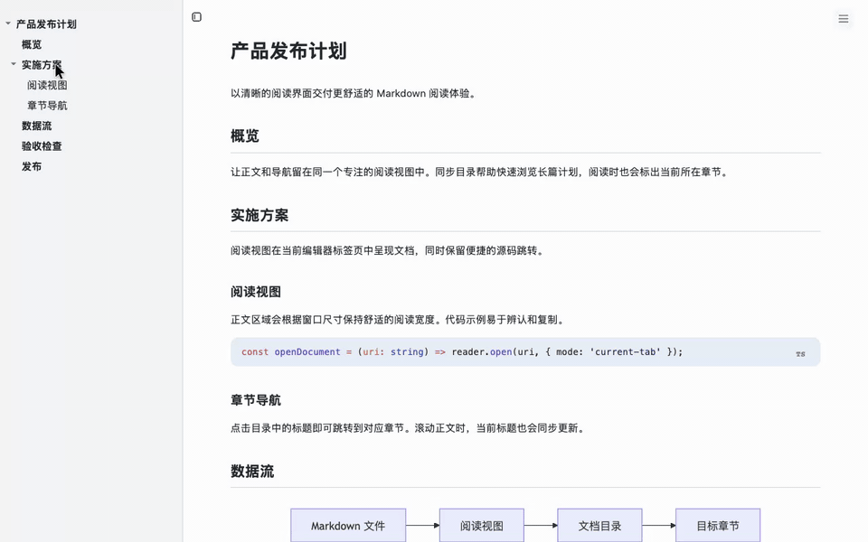
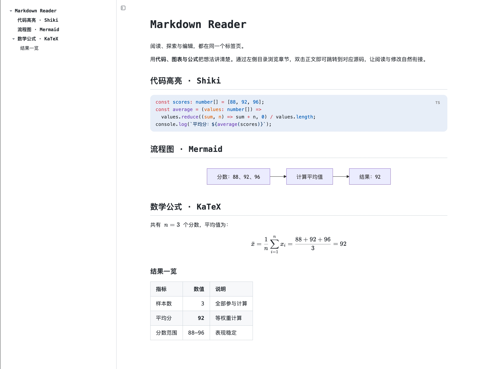
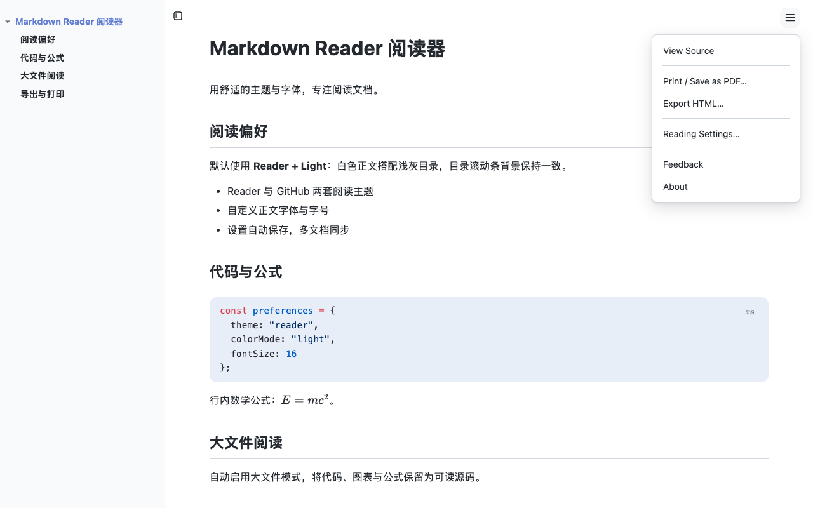
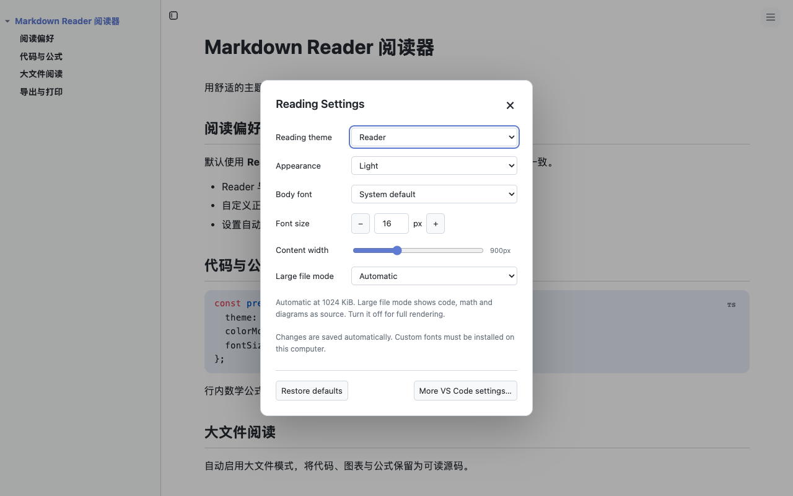

# Markdown Reader

**在 VS Code 当前标签页中，像读文档一样阅读 Markdown。**

专为长篇 Markdown 文档设计的阅读视图，带同步目录、代码高亮、Mermaid 图表和数学公式。适合阅读技术规范、README、开发计划和 AI 生成的笔记。



**当前标签页阅读 · 同步目录 · 代码、图表与公式**

[从 VS Code Marketplace 安装](https://marketplace.visualstudio.com/items?itemName=chengjian.vscode-markdown-reader) · [English](README.md) · [GitHub 仓库](https://github.com/ytcheng/vscode-markdown-reader)

## 主要特色



- **主题与字体可选**：Reader / GitHub 主题，浅色、深色或跟随 VS Code 配色，自定义本机字体和 12–32 px 字号。
- **大文件模式**：默认在 1 MiB 时自动启用，将代码、公式和图表显示为源码以减少渲染开销。
- **导出与打印**：导出带内嵌本地资源的 HTML，通过浏览器打印或保存 PDF。
- **当前标签页直接阅读**：以整洁的文档视图打开 Markdown，不强制占用右侧分栏。
- **目录与正文联动**：自动提取标题形成目录；阅读正文时，当前章节会同步高亮。
- **自动刷新并尽量保留位置**：文件被 AI、其他程序或编辑器修改后，阅读视图自动刷新，并尽可能停留在原来的阅读位置。
- **Source / Preview 一键切换**：使用 <kbd>Ctrl</kbd>/<kbd>Cmd</kbd> + <kbd>Shift</kbd> + <kbd>V</kbd> 在源码和阅读视图间切换。
- **文内搜索**：使用 <kbd>Ctrl</kbd>/<kbd>Cmd</kbd> + <kbd>F</kbd> 搜索渲染后的内容，高亮匹配项并可前后跳转。
- **Shiki 代码高亮**：使用 TextMate 语法，保留语言标签和复制按钮；未知语言显示为纯文本。
- **离线图表与公式**：内置 Mermaid 图表及 KaTeX 行内、独立公式渲染。
- **阅读位置直达源码**：双击正文，或点击标题旁的**铅笔图标**，在同一编辑器组打开对应源码行。
- **复制标题链接**：点击标题旁的 **#**，复制经过编码的 `#fragment`，用于本文档内的锚点链接。
- **目录状态记忆**：按文档保存目录显示状态及折叠分支，关闭标签页后重开仍可恢复。
- **版式可调整**：可显示/隐藏目录、拖动调整目录宽度、设置目录深度与正文最大宽度。
- **支持多文档并行阅读**：每个 Markdown 文件拥有独立的阅读标签页。

## 快速开始

1. 从 VS Code Marketplace 安装 [**Markdown Reader: Focus Mode**](https://marketplace.visualstudio.com/items?itemName=chengjian.vscode-markdown-reader)。
2. 打开任意 `.md` 文件。Markdown Reader 已注册为 Markdown 的默认阅读编辑器。
3. 如果 VS Code 以文本编辑器打开文件，在编辑器标题栏菜单中选择 **Reopen Editor With…**，然后选择 **Markdown Reader**。

### 阅读与编辑切换

| 目标 | 操作方式 |
| --- | --- |
| 打开阅读视图 | 运行 **Markdown Reader: Open Preview** |
| 返回 Markdown 源码 | 运行 **Markdown Reader: Open Source** |
| 编辑指定段落 | 双击正文，或点击标题旁的铅笔图标 |
| 复制标题链接 | 点击标题旁的 **#** |
| 切换 Source / Preview | <kbd>Ctrl</kbd>/<kbd>Cmd</kbd> + <kbd>Shift</kbd> + <kbd>V</kbd> |
| 显示或隐藏目录 | 运行 **Markdown Reader: Toggle Table of Contents** |
| 调整主题、字体和字号 | 右上角 **☰ → Reading Settings…** |
| 导出 HTML | 右上角 **☰ → Export HTML…** |
| 打印或保存 PDF | 右上角 **☰ → Print / Save as PDF…** |
| 搜索已渲染的文档 | <kbd>Ctrl</kbd>/<kbd>Cmd</kbd> + <kbd>F</kbd> |

也可以通过命令面板（`Ctrl`/`Cmd` + `Shift` + `P`）搜索 **Markdown Reader**，运行所有相关命令。

## 阅读设置、打印与导出

正文右上角的 **☰** 菜单提供查看源码、**Print / Save as PDF…**、**Export HTML…**、**Reading Settings…**、反馈与关于。



默认使用 **Reader + Light** 白色主题，目录及其滚动条背景为 `rgb(249, 250, 251)`。阅读设置弹窗支持 **Reader / GitHub** 排版主题，独立的浅色、深色与跟随 VS Code 配色，自定义本机正文字体，12–32 px 字号和正文宽度。标题随字号缩放，代码保持等宽字体；VS Code 高对比度始终优先。设置即时生效并自动保存：存在工作区覆盖时更新对应作用域，否则保存到用户设置；打开的阅读器会同步更新。



大文件模式生效时显示 **⚡**，点击可打开设置。模式会跳过语法高亮、公式和图表渲染，保留源码、目录、复制与搜索；关闭后恢复完整渲染。它降低渲染成本，但不对 Markdown 解析或全部 DOM 做分页。

**导出 HTML** 会弹出保存对话框，内嵌样式、可读取的本地图片和公式字体；HTTPS 图片仍依赖网络。已完成渲染的 Mermaid 图表作为 SVG 图片保留；未完成或大文件模式下保留源码并提示。自定义系统字体不会打包到 HTML。

**打印 / 保存 PDF** 会在默认浏览器打开临时 HTML，点击页面中的打印按钮后使用浏览器打印对话框。打印版式隐藏操作控件，采用浅色纸张样式、代码自动换行和分页优化。V0.3 不提供原生 PDF 文件生成；远程扩展环境请先导出 HTML 并下载到本机浏览器打印。

命令面板也提供 **Markdown Reader: Reading Settings**、**Export HTML** 和 **Print / Save as PDF**，在阅读器激活时可用。

## 配置项

在 VS Code 设置中搜索 Markdown Reader，或在 `settings.json` 中加入：

```json
{
  "markdownReader.theme": "reader",
  "markdownReader.colorMode": "light",
  "markdownReader.fontFamily": "",
  "markdownReader.fontSizeMode": "editor",
  "markdownReader.fontSize": 16,
  "markdownReader.largeFile.mode": "auto",
  "markdownReader.largeFile.thresholdKb": 1024,
  "markdownReader.toc.enabled": true,
  "markdownReader.toc.maxDepth": 3,
  "markdownReader.toc.width": 260,
  "markdownReader.content.maxWidth": 900
}
```

| 配置项 | 默认值 | 说明 |
| --- | ---: | --- |
| `markdownReader.toc.enabled` | `true` | 打开文档时是否显示目录。 |
| `markdownReader.toc.maxDepth` | `3` | 目录展示到第几级标题（`1`–`6`）。 |
| `markdownReader.toc.width` | `260` | 目录默认宽度，单位为像素（`180`–`480`）；也可以在阅读器中拖动调整。 |
| `markdownReader.content.maxWidth` | `900` | 正文最大宽度，单位为像素（`560`–`1600`）。 |
| `markdownReader.theme` | `reader` | `reader` / `github` 排版。 |
| `markdownReader.colorMode` | `light` | `auto` / `light` / `dark` 配色。 |
| `markdownReader.fontFamily` | `""` | 空字符串使用系统字体；也可填 `"Noto Sans SC", sans-serif` 等本机字体列表。 |
| `markdownReader.fontSizeMode` | `editor` | `editor` 跟随 VS Code 的 `editor.fontSize`；`custom` 使用 `markdownReader.fontSize`。 |
| `markdownReader.fontSize` | `16` | 自定义正文字号，12–32 px。 |
| `markdownReader.largeFile.mode` | `auto` | `auto` / `on` / `off`。 |
| `markdownReader.largeFile.thresholdKb` | `1024` | 自动开启阈值，按 UTF-8 字节数计算，单位 KiB。 |


## Markdown 支持范围

Markdown Reader 支持日常文档与笔记常用的 Markdown 语法：

- CommonMark 基础语法：标题、段落、强调、列表、引用、代码、分割线
- 表格、任务列表、删除线、自动链接和围栏代码块
- 本地图片与 HTTPS 图片
- 文内锚点、Markdown 文件链接和外部网页链接

使用标记为 `mermaid` 的围栏代码块绘制图表，使用 `$...$` 编写行内公式、`$$...$$` 编写独立公式。Mermaid 图表会跟随阅读外观切换明暗配色，切换后自动更新。图表语法错误时保留源码并提示，公式错误不会中断整篇文档。语法、图表脚本、字体和样式均已内置，可离线使用。图表和公式在本地渲染，不会上传文档内容，也不需要 API Key。

源码定位到所点击 Markdown 块的起始行；链接、按钮和表单控件保留各自行为。每个工作区最多记住最近 100 个文档 URI 的目录状态，已打开的分屏预览独立维护状态。`toc.enabled` 作为没有历史记录时的默认值。

仍不渲染 Markdown 原生 HTML。图表在隔离的本地页面生成，以不可交互的 SVG 图片显示。搜索排除标题操作按钮、图表和公式内部内容。

## 安全与链接处理

为保证安全，扩展仅允许打开 `https:`、`http:` 和 `mailto:` 外部链接，其他协议会被拦截。本地图片仅能从工作区根目录读取；如果文档位于工作区外，则仅能从该文档所在目录读取。

## 开发

```bash
npm install
npm run check
```

## 许可证

[MIT](LICENSE)
