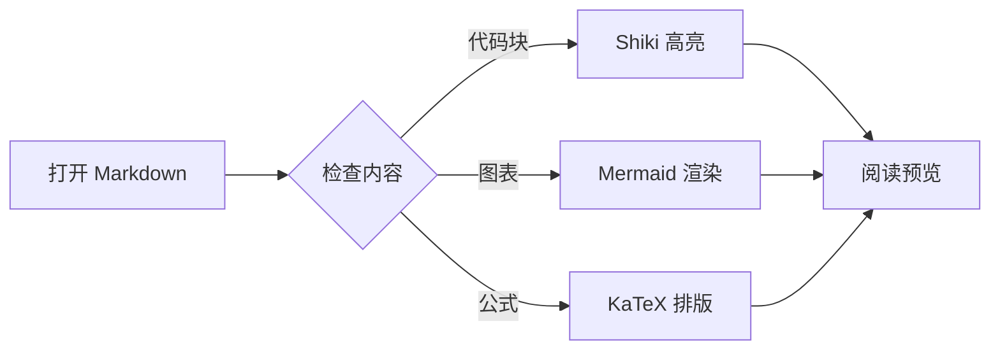
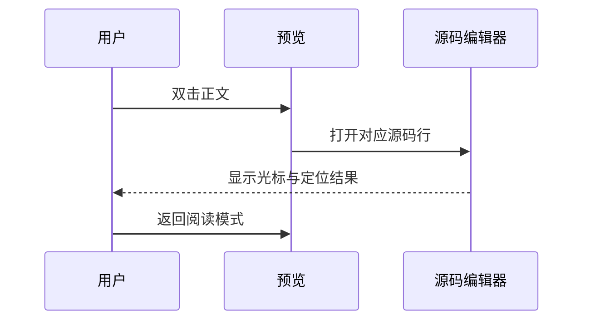
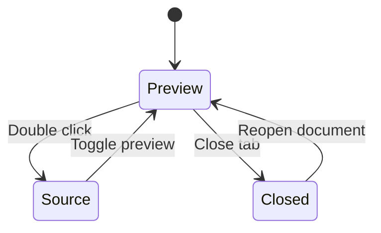

# Markdown Reader V0.2 功能测试

这是一份可直接操作的测试文档。请使用 **Markdown Reader** 打开；如果当前显示源码，可以按 `Cmd + Shift + V`，或在编辑器标题栏选择 **Reopen Editor With… → Markdown Reader**。

建议先浏览全文，再按最后的验收清单逐项操作。文末包含刻意写错的图表与公式，用于确认错误不会影响其他内容。

## 1. Shiki 代码高亮

检查关键字、字符串、数字、注释是否呈现不同颜色。将鼠标移到代码块右上角，点击复制按钮，粘贴后应只有代码内容。

### TypeScript

```typescript
interface ReaderOptions {
  theme: 'light' | 'dark';
  tocEnabled: boolean;
}

// 注释、类型、字符串、数字和模板字符串
const options: ReaderOptions = { theme: 'light', tocEnabled: true };
const version = 0.2;

async function loadDocument(path: string): Promise<string> {
  return `Reading ${path}, version ${version}`;
}

console.log(await loadDocument('功能测试.md'), options);
```

### Python

```python
from dataclasses import dataclass

@dataclass
class Heading:
    title: str
    line: int

headings = [Heading("开始", 0), Heading("功能测试", 12)]
for heading in headings:
    print(f"{heading.line + 1}: {heading.title}")
```

### Rust

```rust
#[derive(Debug)]
struct Document<'a> {
    title: &'a str,
    revision: u32,
}

fn main() {
    let document = Document { title: "离线高亮", revision: 2 };
    println!("{:?}", document);
}
```

### 未知语言与 HTML 转义

下面应作为纯文本显示，`<script>` 不应执行，也不应变成页面元素。

```unknown-language
<script>alert('不应执行')</script>
<div>这是一段原样显示的代码</div>
```

## 2. Mermaid 图表

下面应显示图形，而不是 Mermaid 源码。双击图形应打开对应围栏代码块的源码起始行。

### 流程图



### 时序图



### 状态图



## 3. KaTeX 数学公式

### 行内公式

质量与能量的关系是 $E = mc^2$，勾股定理是 $a^2 + b^2 = c^2$。这些公式应嵌在正文中。

普通金额：\$5、\$19.99。代码中的 `$not_math$` 应保持原样，不应被识别为公式。

### 独立公式

下面应显示居中的公式。双击公式，应定位到它的 `$$` 起始行。

$$
\frac{-b \pm \sqrt{b^2 - 4ac}}{2a}
$$

$$
\sum_{i=1}^{n} i = \frac{n(n+1)}{2}
\qquad
\int_0^1 x^2\,dx = \frac{1}{3}
$$

### 矩阵与分段函数

$$
A = \begin{bmatrix}
1 & 2 & 3 \\
4 & 5 & 6 \\
7 & 8 & 9
\end{bmatrix}
$$

$$
f(x) = \begin{cases}
x^2, & x \geq 0 \\
-x, & x < 0
\end{cases}
$$

## 4. 双击正文与源码定位

**双击这一段中的加粗文字。** 应在同一个编辑器组打开本文件源码，光标定位到这一段的起始行。定位单位是 Markdown 块，不是双击字符所在的列。

返回预览后，还可以分别测试下面几种内容：

- 双击第一项，应定位到第一项的起始行。
- 双击第二项的 **加粗文字**，应定位到第二项的起始行。
  - 双击嵌套项，应定位到嵌套项的起始行。

> 双击这段引用文字，应定位到引用中的对应段落。
>
> 这是一段独立的引用段落，可以验证不是总跳到整个引用块的第一行。

| 操作目标 | 预期行为 |
| --- | --- |
| 双击当前表格行 | 定位到对应表格行 |
| 双击代码内容 | 定位到代码块起始行 |
| 点击标题旁的 Edit | 定位到当前标题行 |

标题旁的 **Edit** 和 **#** 在鼠标悬停或键盘聚焦时显示。链接、按钮等控件保留自身操作，不触发正文双击定位。

## 5. Copy Heading Link

### 中文标题与空格

1. 将鼠标移到本节标题上，点击旁边的 **#**。
2. 粘贴到一个文本编辑器，应该得到以 `#` 开头的编码锚点，例如中文字符会被编码成 `%E4…`。
3. 将其放入 Markdown 链接的圆括号中：`[跳转到标题](粘贴的锚点)`。
4. 在预览里点击链接，应跳转到此标题。

[直接测试：跳到中文标题](#中文标题与空格)

### 重复标题

这是第一个同名标题，其链接应为 `#重复标题`（复制时中文部分会编码）。

### 重复标题

这是第二个同名标题，其链接应带有 `-1` 后缀，不应和第一个混淆。

[跳到第一个同名标题](#重复标题) · [跳到第二个同名标题](#重复标题-1)

### Document

本节用于验证标题锚点 `#document` 不会与阅读器自身的页面控件冲突。

[跳到 Document](#document)

## 6. TOC 状态记忆

### 分支 A：保持折叠

折叠左侧目录中的「6. TOC 状态记忆」，然后关闭当前标签页并重新打开本文件。这个分支应仍然折叠。

### 分支 B：目录显示状态

点击正文左上角的目录按钮隐藏目录，关闭标签页后重新打开本文件。目录应仍然隐藏，再点击按钮可展开。

### 分支 C：跨文档和分屏

1. 本文件隐藏目录后，再打开 [另一份测试文档](../test/fixtures/v0.2.md)。另一份文档应使用自己的状态。
2. 回到本文件，确认隐藏状态仍保留。
3. 将本文件拆分到两个编辑器组，分别调整目录状态，已打开的两个预览应互不强制同步。

状态按当前工作区内的文档 URI 保存；重命名或移动文件会使用新的 URI。目录宽度沿用全局设置。

## 7. 错误隔离

下面两处是**故意写错的内容**，看到错误提示是预期结果。

### 错误的 Mermaid

```mermaid
This is deliberately not a valid Mermaid diagram.
```

预期：保留源码，并提示无法渲染图表。

### 错误的公式

$\unknowncommand{这个命令不存在}$

预期：错误公式仍然可见，其余段落、目录和代码高亮正常工作。

## 8. 手动验收清单

- [ ] TypeScript、Python、Rust 代码正常高亮，代码复制内容准确。
- [ ] 未知语言回退为纯文本，HTML 代码没有执行。
- [ ] 流程图、时序图、状态图正常显示。
- [ ] 行内公式、独立公式、矩阵、分段函数正常排版。
- [ ] 双击段落、列表、表格、代码、图表、公式能定位到对应源码块。
- [ ] 标题 Edit 能定位到该标题行。
- [ ] Copy Heading Link 可复制中文锚点，重复标题生成不同链接。
- [ ] 隐藏目录或折叠分支后，关闭标签页再打开能恢复。
- [ ] 多文档、已打开的分屏预览保持各自目录状态。
- [ ] 错误图表和公式不影响其他内容。
- [ ] 暂时断网后重新打开本文件，代码、图表和公式仍可显示。

全文结束。你也可以修改任意一段文字并保存，顺便检查自动刷新和阅读位置恢复。
