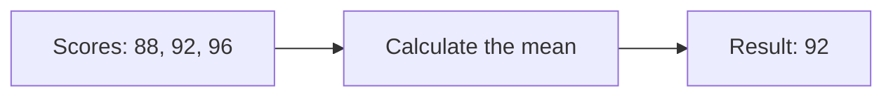

# Markdown Reader

Read, explore, and edit — all in one tab.

Use **code, diagrams, and math** to explain an idea in one place. Follow the table of contents to explore each section, or double-click a passage to edit its source.

## Code · Shiki

```typescript
const scores: number[] = [88, 92, 96];
const average = (values: number[]) =>
  values.reduce((sum, n) => sum + n, 0) / values.length;
console.log(`Average: ${average(scores)}`);
```

## Diagrams · Mermaid



## Math · KaTeX

With $n = 3$ scores, the mean is:

$$
\bar{x} = \frac{1}{n}\sum_{i=1}^{n}x_i = \frac{88 + 92 + 96}{3} = 92
$$

### Results at a glance

| Metric | Value | Note |
| --- | ---: | --- |
| Samples | 3 | All included |
| Average | **92** | Equal weights |
| Range | 88–96 | Consistent scores |
