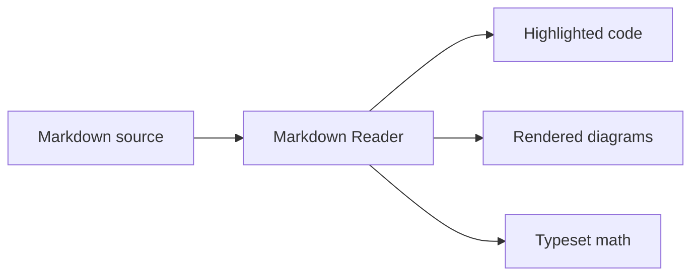
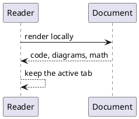
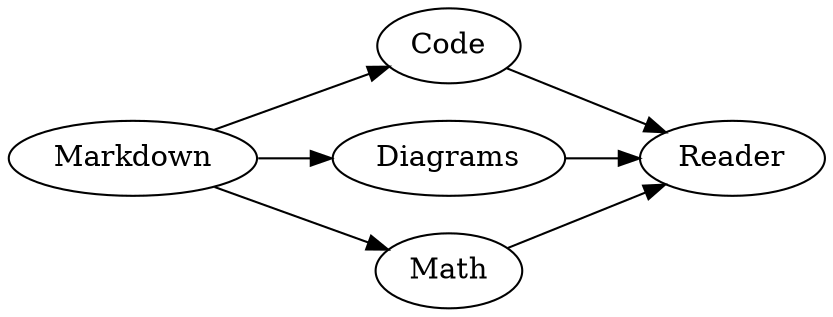

# Markdown Reader — Feature Tour

This Markdown file is open in the current editor tab. Use the table of contents to move between sections, then try the rendered content directly in the preview.

## One tab, easy navigation

Open this file with **Markdown Reader** to read it in the active tab. The table of contents follows the section you are reading. Open the top-right **☰** menu for reading settings, source, export, and print.

## Code with syntax highlighting

Shiki highlights the language syntax and keeps a copy button beside the code.

```typescript
type ReadingMode = 'light' | 'dark';

function greeting(mode: ReadingMode): string {
  const colors = { light: '#ffffff', dark: '#171923' };
  return `Reading in ${mode} mode (${colors[mode]})`;
}

console.log(greeting('light'));
```

## Diagrams, rendered locally

Mermaid, PlantUML, and Graphviz diagrams render with the extension's bundled resources.

### Mermaid flow


```mermaid
flowchart LR
    source[Markdown source] --> reader[Markdown Reader]
    reader --> code[Highlighted code]
    reader --> diagrams[Rendered diagrams]
    reader --> math[Typeset math]
```

### PlantUML sequence


```plantuml
@startuml
Reader -> Document: render locally
Document --> Reader: code, diagrams, math
Reader --> Reader: keep the active tab
@enduml
```

### Graphviz map


```dot
digraph Content {
  rankdir=LR
  Markdown -> Code
  Markdown -> Diagrams
  Markdown -> Math
  Code -> Reader
  Diagrams -> Reader
  Math -> Reader
}
```

Click any diagram to open it in the zoom viewer. Use the controls to zoom or fit it to the preview.

## Math that stays readable

Inline math fits into a sentence: $E = mc^2$.

$$
\bar{x} = \frac{1}{n}\sum_{i=1}^{n}x_i
$$

## Tasks you can update in the preview

- [x] Open the document in the current tab
- [ ] Explore the table of contents
- [ ] Check this task in the preview

Click a checkbox to update the Markdown source from the reading view.

## Images open in the zoom viewer

This standalone local image is clickable too. Try it in the preview, then close the viewer to return to the document.


## Switch between light and dark

Open **☰ → Reading Settings…** and change **Color mode** between **Light** and **Dark**. The reading surface, code, diagrams, and formulas stay legible in either appearance.

## Reading and editing stay connected

Double-click this paragraph to open the source at its Markdown block. Use **Ctrl/Cmd + Shift + V** to switch between Source and Preview. Select a heading's **#** control to copy its link.
