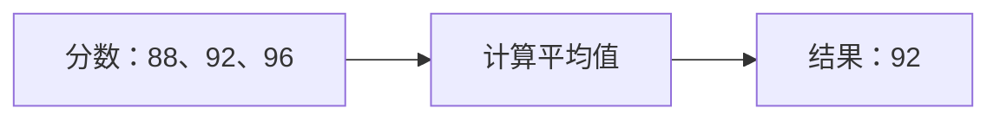

# Markdown Reader

阅读、探索与编辑，都在同一个标签页。

用**代码、图表与公式**把想法讲清楚。通过左侧目录浏览章节，双击正文即可跳转到对应源码，让阅读与修改自然衔接。

## 代码高亮 · Shiki

```typescript
const scores: number[] = [88, 92, 96];
const average = (values: number[]) =>
  values.reduce((sum, n) => sum + n, 0) / values.length;
console.log(`平均分：${average(scores)}`);
```

## 流程图 · Mermaid



## 数学公式 · KaTeX

共有 $n = 3$ 个分数，平均值为：

$$
\bar{x} = \frac{1}{n}\sum_{i=1}^{n}x_i = \frac{88 + 92 + 96}{3} = 92
$$

### 结果一览

| 指标 | 数值 | 说明 |
| --- | ---: | --- |
| 样本数 | 3 | 全部参与计算 |
| 平均分 | **92** | 等权重计算 |
| 分数范围 | 88–96 | 表现稳定 |
