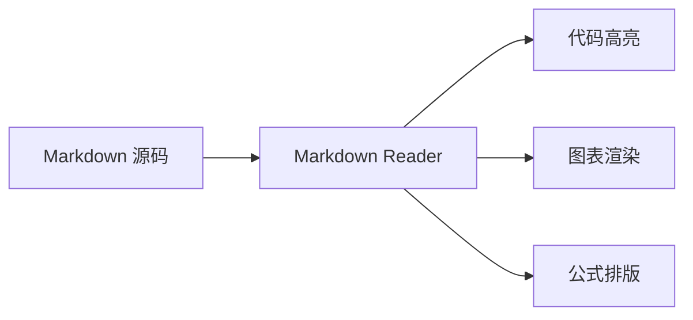
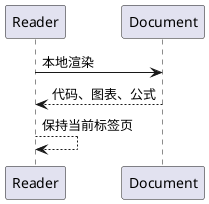
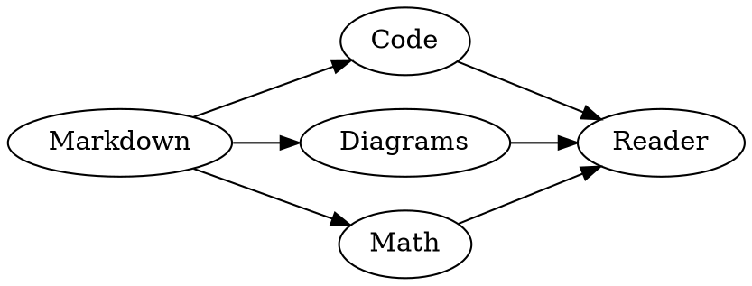

# Markdown Reader — 功能演示

当前标签页打开的是这份 Markdown 文档。使用左侧目录浏览章节，也可以直接操作预览中的内容。

## 当前标签页与目录

使用 **Markdown Reader** 打开本文，即可在当前标签页阅读。左侧目录会跟随阅读位置高亮章节。点击右上角 **☰**，可打开阅读设置、源码、导出和打印菜单。

## 代码高亮

Shiki 会按语言高亮语法，并在代码块旁提供复制按钮。

```typescript
type ReadingMode = '浅色' | '深色';

function greeting(mode: ReadingMode): string {
  const colors = { 浅色: '#ffffff', 深色: '#171923' };
  return `当前是${mode}阅读模式（${colors[mode]}）`;
}

console.log(greeting('浅色'));
```

## 本地渲染图表

扩展内置资源，可本地渲染 Mermaid、PlantUML 和 Graphviz 图表。

### Mermaid 流程图


```mermaid
flowchart LR
    source[Markdown 源码] --> reader[Markdown Reader]
    reader --> code[代码高亮]
    reader --> diagrams[图表渲染]
    reader --> math[公式排版]
```

### PlantUML 时序图


```plantuml
@startuml
Reader -> Document: 本地渲染
Document --> Reader: 代码、图表、公式
Reader --> Reader: 保持当前标签页
@enduml
```

### Graphviz 关系图


```dot
digraph Content {
  rankdir=LR
  Markdown -> Code
  Markdown -> Diagrams
  Markdown -> Math
  Code -> Reader
  Diagrams -> Reader
  Math -> Reader
}
```

点击任意图表可在放大预览中查看，并使用底部控件缩放或适应窗口。

## 公式清晰易读

行内公式可以自然融入句子：$E = mc^2$。

$$
\bar{x} = \frac{1}{n}\sum_{i=1}^{n}x_i
$$

## 在预览中更新任务

- [x] 在当前标签页打开文档
- [ ] 浏览左侧目录
- [ ] 在预览中勾选此项

点击复选框，即可直接从阅读视图更新 Markdown 源码。

## 图片也能点击放大

这张独立图片同样可以点击。试着在预览中打开它，再关闭图片查看器返回文档。


## 切换浅色与深色配色

打开 **☰ → Reading Settings…**，将 **Color mode** 在 **Light** 和 **Dark** 之间切换。两种外观下，正文、代码、图表和公式都会保持清晰。

## 阅读与编辑互相衔接

双击本段可在源码中定位到对应 Markdown 块。使用 **Ctrl/Cmd + Shift + V** 切换 Source 和 Preview，点击标题旁的 **#** 可复制标题链接。
