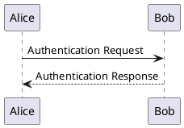
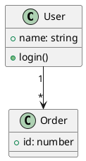
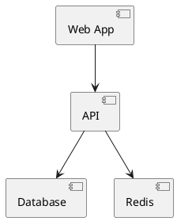
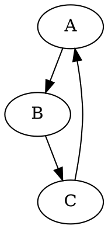
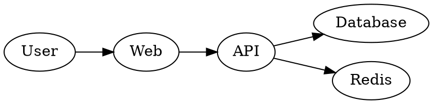
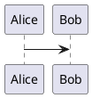
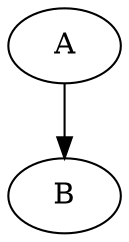

# PlantUML 与 Graphviz 本地渲染实施计划

> **Execution:** 在当前会话中逐任务实施本计划。使用 `- [ ]` 语法跟踪步骤。

**Goal:** 为 Markdown Reader 增加本地 PlantUML 与 Graphviz/DOT SVG 渲染，同时保持现有 Mermaid、KaTeX、普通代码及 Preview/导出行为。

**Architecture:** MarkdownRenderer 只把四种 fence 转为安全的源码图块。Webview 按需创建一个隔离 sandbox iframe，在其中复用 PlantUML 和 Viz.js runtime 并异步返回 SVG；主文档只显示校验后的 SVG 图片。ExportService 按原文顺序嵌入 Webview 提交的有效图像快照。

**Tech Stack:** TypeScript、markdown-it 15、VS Code Webview、esbuild、`@plantuml/core`、`@viz-js/viz`、Vitest/jsdom、VS Code Extension Host tests、`@vscode/vsce`。

**Spec:** [`docs/superpowers/specs/2026-09-28-local-plantuml-graphviz-design.md`](../specs/2026-09-28-local-plantuml-graphviz-design.md)

## Global Constraints

- 渲染完全本地运行；不依赖 Java/JVM、本机 Graphviz、PlantUML Server、Kroki 或其他在线渲染服务。
- `plantuml` / `puml` 使用 PlantUML；`dot` / `graphviz` 使用 Graphviz。
- PlantUML 只调用 `@plantuml/core` 的公开 API；DOT 只调用 `@viz-js/viz` 的公开 API，不导入私有 PlantUML/Viz.js 内部文件。
- PlantUML 回调式 `renderToString(lines, onSuccess, onError)` 包装为 `renderPlantUML(source: string): Promise<string>`。
- Graphviz 通过缓存 `instance(): Promise<Viz>` 复用实例，暴露 `renderGraphviz(source: string): Promise<string>`。
- SVG 不插入主文档 `innerHTML`；显示为经校验的 `data:image/svg+xml` 图片。
- Mermaid 实现与消息协议保持原样；不为本功能重构 Mermaid。
- 大文件模式下四种新 fence 保留源码，不初始化 renderer。
- PlantUML runtime 请求串行执行；单图错误隔离；旧 revision 的异步结果必须丢弃。
- 父子 `script-src` 只增加 `'wasm-unsafe-eval'`（srcdoc iframe 继承父 CSP，Graphviz 真实 Webview probe 证实需要）；不允许 `'unsafe-eval'`，其他来源不变；renderer iframe 继续 `sandbox="allow-scripts"`，不授予 `allow-same-origin` 或 VS Code API。
- Renderer 不从网络加载脚本、标准库、字体、图像或其他资源；未随扩展发布的 PlantUML include 显示为局部错误。
- `.vscodeignore` 保留 `dist/extension.js`、运行所需 `media/`、`assets/`、README、CHANGELOG、许可证与清单，排除源码、测试、source map 和依赖开发素材。
- README 英文版保留英文截图，中文版本保留中文截图；图片继续使用仓库内相对路径。
- 本计划不包含 Marketplace 发布、推送源码、创建 tag、版本号更新或 changelog 发布条目。

## Review Focus

- PlantUML callback 共享状态遇到并发图块时不能串图；Task 1/4 测试同时提交两个序列图并确认各自 SVG 对应自己的源码。
- DOT 语法失败不能污染共享 Viz.js 实例；Task 2 测试一次失败后紧接着渲染有效 DOT。
- 恶意或畸形 SVG 不能成为可执行内容或外部资源请求；Task 4 测试 `<script>`、事件属性、`javascript:`、外部 `<image>` 与 CSS `url()`。
- 刷新后到达的旧 SVG 不能覆盖新文档；Task 4 测试等待旧请求期间替换文档，再释放旧响应。
- 多 renderer 导出中的空快照不能使 Mermaid、PlantUML、Graphviz 图片错位；Task 6 测试混合顺序与待处理图块。

---

## 文件结构

| 文件 | 职责 |
| --- | --- |
| `src/webview/renderers/plantuml.ts` | 包装 PlantUML callback API、串行调用并返回 SVG Promise。 |
| `src/webview/renderers/graphviz.ts` | 初始化并复用单个 `@viz-js/viz` instance，返回 DOT SVG。 |
| `src/webview/local-diagram-frame.ts` | 沙箱子页消息入口；校验请求并调用正确的 renderer。 |
| `src/webview/local-diagram-bootstrap.ts` | 生成 opaque sandbox iframe 的 nonce bootstrap，与父页面建立受限消息通道。 |
| `src/webview/LocalDiagramFrame.ts` | 父页面 iframe 管理、资源加载、请求 ID、timeout、结果关联与 disposal。 |
| `src/webview/LocalDiagramRenderer.ts` | 查找 Markdown 图块、派发异步渲染、更新图片/错误/源码回退并丢弃旧结果。 |
| `src/security/svg.ts` | 校验 SVG 根元素、危险节点/属性/URL，并编码/校验 SVG data URI。 |
| `src/renderer/MarkdownRenderer.ts` | 识别语言别名并输出含转义源码的图块。 |
| `src/webview/ReaderApp.ts` | 文档替换后启动新图渲染、释放 renderer，并保护文档 revision。 |
| `src/webview/html.ts` 与 `src/editor/MarkdownEditorProvider.ts` | 向 Webview 提供本地 sandbox HTML 和扩展资源 URI。 |
| `src/webview/localization.ts`、`media/reader.less` | 图块加载/错误文案及响应式样式。 |
| `src/webview/ReaderControls.ts`、`src/export/ExportService.ts` | 按文档顺序收集、验证、嵌入图像快照。 |
| `esbuild.mjs`、`.vscodeignore` | 构建沙箱/runtime 资源、收集实际 bundle 许可证并核对 VSIX 内容。 |
| `test/unit/PlantUmlRenderer.test.ts`、`test/unit/GraphvizRenderer.test.ts` | 覆盖 API 包装、串行化、单例及 renderer 错误隔离。 |
| `test/unit/LocalDiagramFrame.test.ts`、`test/unit/LocalDiagramRenderer.test.ts` | 覆盖 iframe 协议、DOM 生命周期与过期响应。 |
| `test/unit/SvgSafety.test.ts` | 覆盖 SVG 内容和 data URI 策略。 |
| `test/fixtures/local-diagrams.md` | PlantUML、DOT、Mermaid、KaTeX、普通代码共同出现的真实 Webview 样例。 |
| `test/fixtures/diagram-performance.md` | 五个 Mermaid、五个 PlantUML、五个 Graphviz 图加公式/代码/图片/表格的性能样例。 |
| `test/extension/suite/localDiagramRuntime.test.ts` | 在真实 VS Code Webview 验证本地包、WASM/worker、CSP 和 SVG 输出。 |

## Task 1: 捕获基准并验证 PlantUML Webview runtime

**Files:**
- Create: `src/webview/renderers/plantuml.ts`
- Create: `src/types/plantuml-core.d.ts`
- Create: `src/webview/local-diagram-bootstrap.ts`
- Create: `src/webview/local-diagram-frame.ts`
- Create: `src/webview/LocalDiagramFrame.ts`
- Create: `media/local-diagram-frame.html`, `media/local-diagram-frame.js`, `media/local-diagram-frame.js.map`, `media/plantuml-viz-global.js`
- Create: `media/vendor/@plantuml/core/LICENSE`
- Create: `test/unit/PlantUmlRenderer.test.ts`
- Create: `test/unit/LocalDiagramFrame.test.ts`
- Create: `test/extension/suite/localDiagramRuntime.test.ts`
- Create: `test/support/localDiagramProbe.ts`
- Modify: `package.json`, `package-lock.json`, `esbuild.mjs`, `.vscodeignore`
- Modify: `src/webview/html.ts`, `src/editor/MarkdownEditorProvider.ts`
- Modify: `media/vendor/BUNDLED_PACKAGES.txt`
- Modify: `test/extension/runTest.ts`, `test/extension/suite/index.ts`

**Interfaces:**
- Produces: `renderPlantUML(source: string): Promise<string>`。
- Produces: `LocalDiagramFrame.render(id: string, language: 'plantuml', source: string): Promise<string>`。
- Produces: `LocalDiagramFrame.dispose(): void`。
- Produces: Webview options `localDiagramFrameUri`、`localDiagramScriptUri`、`plantUmlVizScriptUri`；Provider 只暴露扩展内资源 URI。
- Produces: 子 frame protocol：ready `{ type: 'localDiagramBootstrapReady' }`；初始化 `{ type: 'initializeLocalDiagramRuntime', plantUmlVizScript: string, runtimeScript: string }`，初始化完成回 `{ type: 'localDiagramRuntimeReady' }`；render `{ type: 'renderDiagram', id: string, language: 'plantuml', source: string }`；响应为 `{ type: 'diagramResult', id: string, svg: string }` 或 `{ type: 'diagramError', id: string, error: string }`。
- Produces: 本地 `media/local-diagram-frame.html` 与 `media/local-diagram-frame.js`，以及 PlantUML 要求的本地 classic `viz-global.js` 资源。

- [ ] **Step 1: 编写 callback API 单元测试**

在 `test/unit/PlantUmlRenderer.test.ts` 用 Vitest mock `@plantuml/core`：传入 `@startuml\nAlice -> Bob\n@enduml` 时，断言 `renderToString` 收到按行拆分的源码，成功 callback 返回 SVG 字符串；错误 callback 使 Promise reject。

```ts
import { expect, it, vi } from 'vitest';
import { renderPlantUML } from '../../src/webview/renderers/plantuml.js';

const svg = '<svg xmlns="http://www.w3.org/2000/svg"><text>Alice</text></svg>';
const renderToString = vi.hoisted(() => vi.fn());
vi.mock('@plantuml/core', () => ({ renderToString }));

it('wraps renderToString success and error callbacks', async () => {
  renderToString.mockImplementationOnce((_lines, onSuccess) => onSuccess(svg));
  await expect(renderPlantUML('@startuml\nAlice -> Bob\n@enduml')).resolves.toBe(svg);
  expect(renderToString).toHaveBeenCalledWith(
    ['@startuml', 'Alice -> Bob', '@enduml'], expect.any(Function), expect.any(Function)
  );
});

it('serializes PlantUML callbacks and continues after a rejected render', async () => {
  let failFirst!: (message: string) => void;
  renderToString
    .mockImplementationOnce((_lines, _success, onError) => { failFirst = onError; })
    .mockImplementationOnce((_lines, onSuccess) => onSuccess(svg));
  const first = renderPlantUML('@startuml\ninvalid\n@enduml');
  const second = renderPlantUML('@startuml\nAlice -> Bob\n@enduml');
  await vi.waitFor(() => expect(renderToString).toHaveBeenCalledTimes(1));
  failFirst('Invalid PlantUML');
  await expect(first).rejects.toThrow('Invalid PlantUML');
  await expect(second).resolves.toBe(svg);
  expect(renderToString).toHaveBeenCalledTimes(2);
});
```

- [ ] **Step 2: 运行测试确认缺少 adapter 时失败**

Run: `npm run test:unit -- test/unit/PlantUmlRenderer.test.ts`
Expected: FAIL，指出 `renderPlantUML` 模块或导出不存在。

- [ ] **Step 3: 记录依赖变更前 VSIX 基准**

在 `.vscodeignore` 排除 `.superpowers/`，避免本地 ledger/brief 进入 VSIX；该目录不是运行资源。

Run: `npm run build`
Run: `npx --yes @vscode/vsce package --no-dependencies --out /tmp/markdown-reader-before.vsix`
Run: `ls -lh /tmp/markdown-reader-before.vsix`
Expected: 生成可读的基准包大小；将字节数记入最终报告草稿，不把 `.vsix` 加入仓库。

- [ ] **Step 4: 固定 PlantUML 依赖版本**

Run: `npm install --save-exact @plantuml/core`
Expected: `package.json` 与 `package-lock.json` 同步增加生产依赖；此阶段不安装 `@viz-js/viz`。

- [ ] **Step 5: 实现最小 PlantUML Promise adapter**

在 `src/webview/renderers/plantuml.ts` 调用公开 `renderToString`；以 `source.split(/\r\n|\r|\n/)` 提供源码行；把成功 callback resolve、错误 callback reject。为避免 `@plantuml/core` 共享内部状态错配，并发调用通过模块级 Promise queue 顺序执行；每个 queue 项的 rejection 由本项返回，不得阻断后续项。

```ts
import { renderToString } from '@plantuml/core';

let queue: Promise<void> = Promise.resolve();

export function renderPlantUML(source: string): Promise<string> {
  const render = () => new Promise<string>((resolve, reject) => {
    renderToString(source.split(/\r\n|\r|\n/), resolve, reject);
  });
  const result = queue.then(render, render);
  queue = result.then(() => undefined, () => undefined);
  return result;
}
```

- [ ] **Step 6: 运行 adapter 测试确认通过**

Run: `npm run test:unit -- test/unit/PlantUmlRenderer.test.ts`
Expected: callback 成功和错误两个断言均 PASS。

- [ ] **Step 7: 为 frame 握手与 request map 写失败单元测试**

在 `test/unit/LocalDiagramFrame.test.ts` 按已有 `MermaidFrame.test.ts` 的模式创建 fake iframe。校验 child 的 bootstrap-ready 后先收到本地 `viz-global.js` 与 runtime bundle；runtime-ready 后收到 render 请求；只接收当前 iframe 发来的匹配 ID 结果。

- [ ] **Step 8: 运行 frame 测试确认缺少 bridge 时失败**

Run: `npm run test:unit -- test/unit/LocalDiagramFrame.test.ts`
Expected: FAIL，指出 `LocalDiagramFrame` 模块或 render bridge 不存在。

- [ ] **Step 9: 让 Extension Host 测试匹配 manifest 并隔离本地 profile**

将 `test/extension/runTest.ts` 的 `version` 从 `1.100.0` 改为 `1.120.0`，与 `package.json` 的 `engines.vscode: ^1.120.0` 对齐。启动前删除父 VS Code 环境的 `ELECTRON_RUN_AS_NODE`、`VSCODE_PID`、`VSCODE_CWD`；在 `/tmp/mdr-vscode-test-*` 创建短 user-data/extensions 目录并在 `finally` 清理，避免继承 Electron Node 模式或超过 macOS 的 socket 路径长度限制。

- [ ] **Step 10: 编写 Extension Host POC 测试并确认缺少 runtime 时失败**

在 `test/extension/suite/localDiagramRuntime.test.ts` 建立真实 VS Code Webview，加载 PlantUML probe 脚本，并等待 `plantumlProbeResult`。`test/support/localDiagramProbe.ts` 创建 `sandbox="allow-scripts"` iframe、使用固定 protocol 加载父页面传来的本地资源并请求序列图；在 `esbuild.mjs` 先只增加 test probe 的 `dist/test/localDiagramProbe.js` bundle，并注册 suite。

Run: `npm run test:extension`
Expected: FAIL，报缺少 `media/local-diagram-frame.html`/runtime bundle，或 probe 收到 renderer unavailable；不能用 mock SVG 把真实 runtime 测试变绿。

- [ ] **Step 11: 构建本地 opaque sandbox POC**

修改 `esbuild.mjs`：打包 `local-diagram-frame.ts` 到 `media/local-diagram-frame.js`；将官方 `viz-global.js` 放入 `media/`；将 `local-diagram-bootstrap.ts` 嵌入 `media/local-diagram-frame.html`；将 `test/support/localDiagramProbe.ts` 打包为 `dist/test/localDiagramProbe.js`。父 frame manager 从允许的扩展资源 URI 读取两个本地脚本并传给 sandbox；bootstrap 先执行 classic `viz-global.js`，再执行 bundled frame script。子页默认拒绝其他资源、允许 nonce 脚本、仅按 Webview 实测开放 wasm/worker 所需指令。父子消息只传 renderer、ID、源码与 SVG/错误，不加入 `allow-same-origin`。

```js
const diagramBundle = await build({
  entryPoints: ['src/webview/local-diagram-frame.ts'], bundle: true,
  platform: 'browser', format: 'iife', outfile: 'media/local-diagram-frame.js',
  minify: true, sourcemap: true
});
await cp('node_modules/@plantuml/core/viz-global.js', 'media/plantuml-viz-global.js');
```

- [ ] **Step 12: 用真实 VS Code Webview 验证 PlantUML POC**

在该 extension-host test 中使用扩展实际打包的 `viz-global.js`、renderer bundle 和 bootstrap 渲染序列图 `@startuml\nAlice -> Bob: Hello\nBob --> Alice: Hi\n@enduml`。断言返回字符串以 `<svg` 开始，frame sandbox 属性精确为 `allow-scripts`，渲染过程无 CSP/脚本错误。probe 只负责验证真实 sandbox protocol，不复用生产 `LocalDiagramFrame`。

- [ ] **Step 13: 运行 unit 与 extension-host POC**

Run: `npm run test:extension`
Run: `npm run test:unit -- test/unit/PlantUmlRenderer.test.ts test/unit/LocalDiagramFrame.test.ts`
Expected: 新的 PlantUML Webview 用例与 bridge tests 通过；若 Webview 失败，只依据错误修正 bundling、worker/WASM 或子页 CSP，不能启用主 Webview 的 `'unsafe-eval'` 或网络源。

- [ ] **Step 14: 记录 PlantUML-only 包体积**

Run: `npm run build`
Run: `npx --yes @vscode/vsce package --no-dependencies --out /tmp/markdown-reader-plantuml.vsix`
Run: `ls -lh /tmp/markdown-reader-plantuml.vsix`
Expected: 获得 `PlantUML only` VSIX 大小并记入最终报告草稿。

- [ ] **Step 15: 提交 PlantUML runtime POC**

Run: `git add package.json package-lock.json esbuild.mjs .vscodeignore src/types/plantuml-core.d.ts src/webview/html.ts src/editor/MarkdownEditorProvider.ts src/webview/LocalDiagramFrame.ts src/webview/local-diagram-bootstrap.ts src/webview/local-diagram-frame.ts src/webview/renderers/plantuml.ts media/local-diagram-frame.html media/local-diagram-frame.js media/local-diagram-frame.js.map media/plantuml-viz-global.js media/vendor/BUNDLED_PACKAGES.txt media/vendor/@plantuml/core/LICENSE test/unit/PlantUmlRenderer.test.ts test/unit/LocalDiagramFrame.test.ts test/extension/runTest.ts test/extension/suite/index.ts test/extension/suite/localDiagramRuntime.test.ts test/support/localDiagramProbe.ts && git commit -m "feat: add local PlantUML runtime"`
Expected: 只提交已通过 POC 的 PlantUML adapter、沙箱桥接和打包改动。

## Task 2: 加入独立 Graphviz runtime

**Files:**
- Create: `src/webview/renderers/graphviz.ts`
- Create: `test/unit/GraphvizRenderer.test.ts`
- Modify: `package.json`, `package-lock.json`
- Modify: `src/webview/local-diagram-frame.ts`, `src/webview/LocalDiagramFrame.ts`
- Modify: `src/webview/html.ts`, `esbuild.mjs`, `THIRD_PARTY_NOTICES.md`
- Add: `media/vendor/@viz-js/viz/{Viz.js-MIT.txt,Graphviz-EPL-2.0.txt,Expat-MIT.txt}`
- Modify: `test/extension/suite/localDiagramRuntime.test.ts`, `test/support/localDiagramProbe.ts`

**Interfaces:**
- Consumes: `LocalDiagramFrame.render(id, 'plantuml', source)` 与 PlantUML adapter。
- Produces: `renderGraphviz(source: string): Promise<string>`。
- Produces: 子 frame protocol 在 Graphviz 请求中接受 `language: 'graphviz'`。
- Produces: 为真实 Viz.js WASM 渲染，父子 `script-src` 增加 `'wasm-unsafe-eval'`；不启用 JavaScript `'unsafe-eval'`。
- Produces: `LocalDiagramFrame.render(id, language: 'plantuml' | 'graphviz', source: string): Promise<string>`。

- [x] **Step 1: 编写 Graphviz 单例与失败恢复测试**

在 `test/unit/GraphvizRenderer.test.ts` mock `@viz-js/viz`。两次有效调用共用一次 `instance()`；第一次 `renderString()` 抛出语法错误后，第二次有效 DOT 仍返回 SVG。

```ts
import { expect, it, vi } from 'vitest';
import { renderGraphviz } from '../../src/webview/renderers/graphviz.js';

const instance = vi.hoisted(() => vi.fn());
vi.mock('@viz-js/viz', () => ({ instance }));

it('reuses one Viz instance and keeps later DOT renders usable after an error', async () => {
  const renderString = vi.fn()
    .mockImplementationOnce(() => { throw new Error('syntax error near line 3'); })
    .mockReturnValue('<svg xmlns="http://www.w3.org/2000/svg"></svg>');
  instance.mockResolvedValue({ renderString });

  await expect(renderGraphviz('digraph { A -> }')).rejects.toThrow('syntax error near line 3');
  await expect(renderGraphviz('digraph { A -> B }')).resolves.toContain('<svg');
  expect(instance).toHaveBeenCalledTimes(1);
  expect(renderString).toHaveBeenCalledTimes(2);
});
```

- [x] **Step 2: 运行 Graphviz 测试确认缺少实现时失败**

Run: `npm run test:unit -- test/unit/GraphvizRenderer.test.ts`
Expected: FAIL，指出 `renderGraphviz` 或 Graphviz runtime adapter 缺失。

- [x] **Step 3: 固定 Viz.js 生产依赖**

Run: `npm install --save-exact @viz-js/viz`
Expected: `package.json` 与 `package-lock.json` 增加独立 Graphviz/WASM runtime。

- [x] **Step 4: 实现 Graphviz 单例 adapter**

在 `src/webview/renderers/graphviz.ts` 缓存 `instance()` Promise；调用 `viz.renderString(source, { format: 'svg' })`；把渲染异常转成 rejected Promise。初始化 Promise reject 时清空缓存，使用户刷新或重试后可重新初始化。

```ts
import { instance } from '@viz-js/viz';

type GraphvizInstance = Awaited<ReturnType<typeof instance>>;
let graphvizPromise: Promise<GraphvizInstance> | undefined;
function getGraphviz(): Promise<GraphvizInstance> {
  graphvizPromise ??= instance().catch((error) => { graphvizPromise = undefined; throw error; });
  return graphvizPromise;
}
export async function renderGraphviz(source: string): Promise<string> {
  return (await getGraphviz()).renderString(source, { format: 'svg' });
}
```

- [x] **Step 5: 先扩展真实 Webview 测试覆盖 DOT 路由**

修改 `test/support/localDiagramProbe.ts`：PlantUML SVG 返回后再发送 `language: 'graphviz'` 的 `digraph G { A -> B; B -> C; C -> A }`；Extension Host test 断言两个 SVG 都返回。为 probe 添加 10 秒 timeout，超时上报空 Graphviz SVG，确保 RED 是行为断言而不是 Mocha timeout。

- [x] **Step 6: 运行 POC 确认 Graphviz 路由失败**

Run: `npm run test:extension`
Expected: PlantUML SVG PASS，Graphviz SVG assertion FAIL；当前 child runtime 只处理 `plantuml`。

- [x] **Step 7: 把 DOT 请求路由到 Viz.js 并开放最窄 WASM CSP 权限**

扩展 `src/webview/local-diagram-frame.ts` 的类型分发：`plantuml` 调用 `renderPlantUML`，`graphviz` 调用 `renderGraphviz`；把 `LocalDiagramFrame.render`、子请求校验及 response message 的 language union 扩展为 `plantuml | graphviz`。保留单请求 try/catch，使一个失败只回传该请求的 error。Graphviz WebAssembly 的真实 Webview 渲染证明 srcdoc 父子 CSP 均需要 `'wasm-unsafe-eval'`；在 `html.ts` 主策略与生成的 child frame 策略加该 token，不加入 `'unsafe-eval'` 或网络来源。

- [x] **Step 8: 运行 Graphviz 单测与真实 Webview POC**

Run: `npm run test:unit -- test/unit/GraphvizRenderer.test.ts`
Run: `npm run test:extension`
Expected: Graphviz instance 单例/失败恢复断言和 PlantUML+Graphviz Webview SVG 均 PASS，无 CSP violation。

- [x] **Step 9: 记录 PlantUML + Graphviz runtime POC 包体积**

Run: `npm run build`
Run: `npx --yes @vscode/vsce package --no-dependencies --out /tmp/markdown-reader-plantuml-graphviz.vsix`
Run: `ls -lh /tmp/markdown-reader-plantuml-graphviz.vsix`
Expected: 获得独立 Graphviz runtime 增量；Task 7 再生成最终集成版 VSIX。

- [x] **Step 10: 提交 Graphviz runtime 与 CSP 兼容调整**

Run: `git add package.json package-lock.json esbuild.mjs src/webview/html.ts src/webview/renderers/graphviz.ts src/webview/local-diagram-frame.ts src/webview/LocalDiagramFrame.ts media/local-diagram-frame.html media/local-diagram-frame.js media/local-diagram-frame.js.map media/vendor/BUNDLED_PACKAGES.txt media/vendor/@viz-js/viz THIRD_PARTY_NOTICES.md docs/superpowers/specs/2026-09-28-local-plantuml-graphviz-design.md docs/superpowers/plans/2026-09-28-local-plantuml-graphviz.md test/unit/GraphvizRenderer.test.ts test/unit/WebviewHtml.test.ts test/extension/suite/localDiagramRuntime.test.ts test/support/localDiagramProbe.ts && git commit -m "feat: add local Graphviz runtime"`
Expected: DOT adapter、父子 WASM CSP 和真实 POC 通过后提交。

## Task 3: 接入 Markdown fences 与大文件回退

**Files:**
- Modify: `src/renderer/MarkdownRenderer.ts`
- Modify: `test/unit/MarkdownRenderer.test.ts`
- Modify: `test/unit/MarkdownRendererModes.test.ts`

**Interfaces:**
- Consumes: markdown-it fence token 的语言、源码与 `largeFile` 渲染选项。
- Produces: 非大文件模式输出 `<figure class="local-diagram" data-local-diagram="plantuml|graphviz" data-source-line="N"><pre><code>escaped source</code></pre></figure>`。
- Produces: 大文件模式继续输出原普通代码块，不生成 `data-local-diagram`。

- [x] **Step 1: 为四个语言别名写失败单元测试**

给 `test/unit/MarkdownRenderer.test.ts` 增加四个输入，断言 `plantuml`、`puml` 的 `data-local-diagram` 都是 `plantuml`，`dot`、`graphviz` 的值都为 `graphviz`，并保留 `data-source-line` 和转义源码。

```ts
it.each(['plantuml', 'puml'])('marks %s as a PlantUML diagram', async (language) => {
  const result = await new MarkdownRenderer().render(`\`\`\`${language}\n@startuml\nAlice -> Bob\n@enduml\n\`\`\``, 1);
  expect(result.html).toContain('data-local-diagram="plantuml"');
  expect(result.html).toContain('<code>@startuml\nAlice -&gt; Bob\n@enduml\n</code>');
});

it.each(['dot', 'graphviz'])('marks %s as a Graphviz diagram', async (language) => {
  const result = await new MarkdownRenderer().render(`\`\`\`${language}\ndigraph G { A -> B }\n\`\`\``, 1);
  expect(result.html).toContain('data-local-diagram="graphviz"');
});
```

- [x] **Step 2: 运行 parser 测试确认新 fence 还未被标记**

Run: `npm run test:unit -- test/unit/MarkdownRenderer.test.ts`
Expected: 新别名断言 FAIL；现有 Mermaid、普通代码断言保持 PASS。

- [x] **Step 3: 加入 fence 映射**

在 `MarkdownRenderer` fence rule 中对语言先 `trim().split(/\s+/, 1)[0].toLowerCase()`，再按别名生成统一 `data-local-diagram` 值。源码只通过 `markdown-it` 的 `escapeHtml` 写入 `<code>`。

```ts
const kind = language === 'plantuml' || language === 'puml' ? 'plantuml'
  : language === 'dot' || language === 'graphviz' ? 'graphviz'
  : undefined;
if (kind && !(env as RenderEnvironment).largeFile) {
  return `<figure class="local-diagram" data-local-diagram="${kind}" data-source-line="${token.map?.[0] ?? 0}"><pre><code>${this.#md.utils.escapeHtml(token.content)}</code></pre></figure>\n`;
}
```

- [x] **Step 4: 跳过 diagram fence 的 Shiki 计算**

在 `highlightTokens` 遇到 `mermaid`、`plantuml`、`puml`、`dot`、`graphviz` 时跳过 `highlightCode`；普通 TypeScript fence 继续保留 Shiki 和 copy 控件。

```ts
const rendererLanguages = new Set(['mermaid', 'plantuml', 'puml', 'dot', 'graphviz']);
if (rendererLanguages.has(language)) return;
const html = await highlightCode(token.content, language);
```

- [x] **Step 5: 增加大文件模式测试**

在 `MarkdownRendererModes.test.ts` 同时放入四种新标签，`largeFile: true` 时断言 HTML 无 `data-local-diagram` 且代码源码已转义；`largeFile: false` 时断言四种图块重新出现。

- [x] **Step 6: 运行 parser 与大文件单测**

Run: `npm run test:unit -- test/unit/MarkdownRenderer.test.ts test/unit/MarkdownRendererModes.test.ts`
Expected: 新 fence、源码转义、大文件回退和普通代码回归测试全部 PASS。

- [x] **Step 7: 提交 Markdown fence 接入**

Run: `git add src/renderer/MarkdownRenderer.ts test/unit/MarkdownRenderer.test.ts test/unit/MarkdownRendererModes.test.ts && git commit -m "feat: recognize local diagram fences"`
Expected: fence parser 与 source fallback 测试通过后提交。

## Task 4: 实现 Preview 异步图块渲染生命周期

**Files:**
- Create: `src/webview/LocalDiagramRenderer.ts`
- Create: `src/security/svg.ts`
- Create: `test/unit/SvgSafety.test.ts`
- Create: `test/unit/LocalDiagramRenderer.test.ts`
- Modify: `test/unit/LocalDiagramFrame.test.ts`
- Modify: `src/webview/ReaderApp.ts`, `src/webview/LocalDiagramFrame.ts`, `src/webview/localization.ts`
- Modify: `test/unit/ReaderApp.test.ts`
- Modify: `src/webview/renderers/graphviz.ts`, `test/unit/GraphvizRenderer.test.ts` (strip only the standard Graphviz XML/DTD prolog)

**Interfaces:**
- Consumes: fence 的 `figure.local-diagram[data-local-diagram]` 图块、两个 adapter 与 `LocalDiagramFrame.render(id, language, source)`。
- Produces: `LocalDiagramRenderer.render(article: HTMLElement, revision: number): Promise<void>` 与 `dispose(): void`。
- Produces: 构造器为 `new LocalDiagramRenderer(document: Document, renderDiagram?: RenderDiagram)`；默认只在发现图块后创建 `LocalDiagramFrame`。
- Produces: `RenderDiagram = (id: string, language: 'plantuml' | 'graphviz', source: string) => Promise<string>`，供 jsdom 单测注入。
- Produces: `#renderDiagram: RenderDiagram`、`#versions: WeakMap<HTMLElement, number>` 与 `#revision: number`。
- Produces: 每个 renderer 实例拥有单调递增的 `#sequence: number`，确保刷新期间新请求不复用旧 ID。
- Produces: sandbox 初始化/渲染 30 秒超时会 dispose 当前 iframe、reject 其所有 pending 请求，并允许后续请求创建新 iframe，避免卡住的 PlantUML 队列永久阻塞。
- Produces: 成功图块包含 `.local-diagram-image`；失败图块保留可见 `<pre>` 并追加 `.local-diagram-error[role="status"]`。
- Produces: `toSafeSvgDataUri(svg: string): string` 与 `isSafeSvgDataUri(value: string): boolean`。
- Produces: Graphviz adapter strips only the known XML declaration and SVG 1.1 external DTD; the safety validator rejects any remaining DTD/entity.
- Produces: PlantUML's `plantuml-src` processing instruction is allowed as inert source metadata; all other processing instructions are rejected.

- [x] **Step 1: 为 SVG 安全策略写失败测试**

在 `test/unit/SvgSafety.test.ts` 对非 SVG 根、畸形闭合、DOCTYPE/ENTITY、`<script>`、`foreignObject`、大小写任意的 `on*`、`javascript:` href、实体编码危险 scheme、外部 `<image>`、外部 CSS `url()` 期望拒绝；`url(#gradient0)` 和 `href="#node1"` 保持可用。

- [x] **Step 2: 运行 SVG 安全测试确认 helper 缺失**

Run: `npm run test:unit -- test/unit/SvgSafety.test.ts`
Expected: FAIL，指出 `src/security/svg.ts` 或 `toSafeSvgDataUri` 不存在。

- [x] **Step 3: 实现共享 SVG 字符串校验**

实现跨 Webview 与 Extension Host 共用的纯 TypeScript XML tokenizer，校验唯一闭合 SVG namespace 根；拒绝 DOCTYPE/ENTITY、活动节点、事件属性、非 fragment href、危险 CSS URL 和非 `plantuml-src` 处理指令。tokenizer 只校验结构，不把解析节点插入主文档。它会先解码 XML 预定义/数字实体再验证属性。Graphviz adapter 只删除其固定的 XML declaration 和 SVG 1.1 外部 DTD；未知 DTD 继续拒绝。`toSafeSvgDataUri` 与 `isSafeSvgDataUri` 共用该校验函数；后者先验证 data URI prefix 并 percent decode。

```ts
const SVG_PREFIX = 'data:image/svg+xml;charset=utf-8,';
export function toSafeSvgDataUri(svg: string): string {
  validateRendererSvg(svg);
  return `${SVG_PREFIX}${encodeURIComponent(svg)}`;
}
export function isSafeSvgDataUri(value: string): boolean {
  if (!value.startsWith(SVG_PREFIX)) return false;
  try { validateRendererSvg(decodeURIComponent(value.slice(SVG_PREFIX.length))); return true; }
  catch { return false; }
}
```

- [x] **Step 4: 为旧消息与错误隔离写 bridge 测试**

在 `test/unit/LocalDiagramFrame.test.ts` 使用 jsdom fake iframe 和 `postMessage` spy。请求 ID 不匹配、来自非当前 iframe 的消息、未知消息类型均不 resolve 请求；正确 `diagramResult` 按 ID resolve；一个 `diagramError` 只 reject 对应请求。用 fake timers 推进 30 秒，断言 timeout dispose 卡住的 iframe、reject 同 frame 其余 pending 项，下一条 render 创建新 iframe。

- [x] **Step 5: 运行 bridge 测试确认 timeout 与消息边界**

Run: `npm run test:unit -- test/unit/LocalDiagramFrame.test.ts`
Expected: FAIL，证明当前 POC bridge timeout 后未 reset frame，或 pending 请求未被统一 reject。

- [x] **Step 6: 为 DOM lifecycle 写测试**

在 `LocalDiagramRenderer.test.ts` 注入 `renderDiagram` spy，验证成功时 `img.src` 是 SVG data URI 并隐藏源码；失败时图块仍有源码且含 `role="status"` 错误；替换 article 后迟到响应不插入旧图。

```ts
it('keeps source visible when an individual renderer rejects', async () => {
  document.body.innerHTML = '<article><figure class="local-diagram" data-local-diagram="graphviz"><pre><code>broken dot</code></pre></figure></article>';
  const renderer = new LocalDiagramRenderer(async () => { throw new Error('syntax error near line 3'); });
  await renderer.render(document.querySelector('article')!, 1);
  expect(document.querySelector('figure pre')?.hidden).toBe(false);
  expect(document.querySelector('[role="status"]')?.textContent).toContain('Graphviz');
});
```

同一测试文件再控制两个 renderer promise：先启动 revision 1，再写入 revision 2，最后 resolve revision 1；断言旧图块没有 `.local-diagram-image`。失败分支用 `vi.spyOn(console, 'error')` 断言日志包含 renderer 名称与原始异常。

- [x] **Step 7: 实现请求映射和 stale-result guard**

`LocalDiagramRenderer` 为每个 figure 维护版本号和当前 revision；从 `<code>.textContent` 取源，按 `data-local-diagram` 派发请求。await 返回后检查 `figure.isConnected`、figure 版本及 revision；不匹配则丢弃结果。

```ts
this.#revision = revision;
const document = article.ownerDocument;
const figures = [...article.querySelectorAll<HTMLElement>('figure.local-diagram[data-local-diagram]')];
await Promise.all(figures.map(async (figure) => {
  const version = (this.#versions.get(figure) ?? 0) + 1;
  this.#versions.set(figure, version);
  const id = `reader-local-diagram-${++this.#sequence}`;
  const language = figure.dataset.localDiagram as 'plantuml' | 'graphviz';
  const source = figure.querySelector('code')?.textContent ?? '';
  const uiLanguage = document.body.dataset.readerLanguage === 'zh-CN' ? 'zh-CN' : 'en';
  figure.querySelectorAll('.local-diagram-error, .local-diagram-progress').forEach((node) => node.remove());
  const loading = document.createElement('p');
  loading.className = 'local-diagram-progress';
  loading.setAttribute('role', 'status');
  loading.textContent = translate(uiLanguage, 'diagramRendering');
  figure.append(loading);
  try {
    const svg = await this.#renderDiagram(id, language, source);
    if (!figure.isConnected || this.#versions.get(figure) !== version || revision !== this.#revision) return;
    const image = document.createElement('img');
    image.className = 'local-diagram-image';
    image.alt = language === 'plantuml' ? 'PlantUML diagram' : 'Graphviz diagram';
    image.src = toSafeSvgDataUri(svg);
    figure.querySelector('pre')!.hidden = true;
    figure.querySelectorAll('.local-diagram-image, .local-diagram-error, .local-diagram-progress').forEach((node) => node.remove());
    figure.append(image);
  } catch (error) {
    if (!figure.isConnected || this.#versions.get(figure) !== version || revision !== this.#revision) return;
    console.error('Markdown Reader diagram render failed', language, error);
    figure.querySelector('pre')!.hidden = false;
    figure.querySelectorAll('.local-diagram-image, .local-diagram-error, .local-diagram-progress').forEach((node) => node.remove());
    const status = document.createElement('p');
    status.className = 'local-diagram-error';
    status.setAttribute('role', 'status');
    const messageKey = language === 'plantuml' ? 'plantumlRenderFailed' : 'graphvizRenderFailed';
    const detail = error instanceof Error ? error.message : String(error);
    status.textContent = `${translate(uiLanguage, messageKey)} ${detail}`;
    figure.append(status);
  }
}));
```

- [x] **Step 8: 将 renderer 接入 ReaderApp 并增加双语错误文案**

在 `ReaderApp` 声明 `readonly #localDiagrams: LocalDiagramRenderer`，并在 constructor body 用参数 `document` 初始化它，避免 class field 初始化早于 parameter property。可选 `RenderDiagram` 参数只用于注入单测。`applyRender` 写入 `article.innerHTML` 后并行启动 Mermaid 与 local render；不等待它们后再显示文档，但将两个 Promise 放入现有的 scroll restoration 完成逻辑，确保图片替换后可恢复阅读位置。`dispose()` 同时释放 local renderer iframe。在 `localization.ts` 增加英文/中文 `diagramRendering`、`plantumlRenderFailed`、`graphvizRenderFailed` 文案键。

```ts
const diagramWork = Promise.all([
  this.#mermaid.render(this.article),
  this.#localDiagrams.render(this.article, revision)
]);
void diagramWork.then(() => {
  if (revision === this.#revision && this.#scrollTop() === scrollTop) this.#restoreViewport(restore, initialRender);
});
```

- [x] **Step 9: 运行 renderer unit tests**

Run: `npm run test:unit -- test/unit/SvgSafety.test.ts test/unit/LocalDiagramFrame.test.ts test/unit/LocalDiagramRenderer.test.ts test/unit/ReaderApp.test.ts`
Run: `npm run test:unit -- test/unit/GraphvizRenderer.test.ts`
Expected: SVG policy、请求关联、timeout 重置、单图错误、旧 revision 丢弃与现有 ReaderApp 生命周期均 PASS。

- [x] **Step 10: 提交 Preview renderer 与 SVG policy**

Run: `git add src/security/svg.ts src/webview/LocalDiagramRenderer.ts src/webview/LocalDiagramFrame.ts src/webview/ReaderApp.ts src/webview/localization.ts src/webview/renderers/graphviz.ts media/local-diagram-frame.js media/local-diagram-frame.js.map media/reader.js media/reader.js.map test/unit/SvgSafety.test.ts test/unit/GraphvizRenderer.test.ts test/unit/LocalDiagramFrame.test.ts test/unit/LocalDiagramRenderer.test.ts test/unit/ReaderApp.test.ts && git commit -m "feat: render local diagrams asynchronously"`
Expected: Preview lifecycle 与 SVG policy 测试通过后提交。

## Task 5: 沙箱 CSP 与图块响应式样式

**Files:**
- Modify: `src/webview/local-diagram-bootstrap.ts`, `media/local-diagram-frame.html` (generated), `media/reader.less`
- Modify: `test/unit/WebviewHtml.test.ts`, `test/unit/ReaderStyles.test.ts`
- Modify: `test/support/localDiagramProbe.ts` to collect child-frame CSP diagnostics

**Interfaces:**
- Consumes: Task 4 的 SVG validator 与 Webview local renderer。
- Produces: 父子脚本策略均仅额外开放 `'wasm-unsafe-eval'`；主策略其他源不变；子 frame 仍只运行 nonce 脚本，并按需允许 WASM 与 blob worker。
- Produces: 图形容器横向滚动，SVG 自适应最大宽度并保留宽高比。

- [x] **Step 1: 为 CSP 和响应式图样式写断言**

扩展 `WebviewHtml.test.ts` 确认父 CSP 含 `'wasm-unsafe-eval'`、不含 `'unsafe-eval'` 且 script-src 来源不变；扩展 `ReaderStyles.test.ts` 读取 `media/reader.less`，确认 diagram 容器允许横向 overflow，图片 `max-width: 100%` 和 `height: auto`。

- [x] **Step 2: 运行样式断言确认新 selector 不存在**

Run: `npm run test:unit -- test/unit/WebviewHtml.test.ts test/unit/ReaderStyles.test.ts`
Expected: 新 CSS selector 断言 FAIL；父 CSP 现有断言 PASS。

- [x] **Step 3: 收紧 renderer 子页 CSP**

复核 `esbuild.mjs` 生成的 child srcdoc CSP 只包含 `default-src 'none'`、nonce script、`'wasm-unsafe-eval'`、`worker-src blob:`、data 图片、renderer inline style、无 fonts、`connect-src 'none'`；该 policy 已在 Task 2 配置，不增加新的来源或放宽主页面 JavaScript 权限。
在 `local-diagram-bootstrap.ts` 监听 `securitypolicyviolation`，只把 directive 与 blocked URI 汇报给 parent probe，用于确认有效图和离线 include 没有偷偷联网。

```html
<meta http-equiv="Content-Security-Policy"
  content="default-src 'none'; script-src 'nonce-MERMAID_NONCE' 'wasm-unsafe-eval'; worker-src blob:; style-src 'unsafe-inline'; img-src data:; font-src 'none'; connect-src 'none';">
```

- [x] **Step 4: 添加图块响应式样式**

在 `reader.less` 添加以下规则；图块图片不设固定宽高，不覆盖 SVG 内部颜色。

```less
.markdown-body figure.local-diagram { margin: 1.5em 0; max-width: 100%; overflow-x: auto; }
.markdown-body .local-diagram-image { display: block; max-width: 100%; height: auto; margin-inline: auto; }
.markdown-body .local-diagram-progress { color: var(--text-muted); font-size: 0.9em; }
.markdown-body .local-diagram-error { color: var(--danger-color); font-size: 0.9em; }
```

- [x] **Step 5: 固定主 CSP 与响应式样式回归断言**

在 `WebviewHtml.test.ts` 断言主文档仅允许 `'wasm-unsafe-eval'`、仍不允许 `'unsafe-eval'` 且没有新增 script 来源；在 `ReaderStyles.test.ts` 断言本地图块横向滚动、图片 max-width 为 100% 且 height 为 auto。

- [x] **Step 6: 运行 CSP 与样式单测**

Run: `npm run test:unit -- test/unit/WebviewHtml.test.ts test/unit/ReaderStyles.test.ts`
Expected: JavaScript `unsafe-eval` 仍被禁止，图块 overflow 与图片尺寸规则全部 PASS；Extension Host 集成测试验证父子 WASM 策略和子 sandbox。

- [x] **Step 7: 提交沙箱 CSP 与图块样式**

Run: `git add src/webview/local-diagram-bootstrap.ts media/local-diagram-frame.html media/reader.less media/reader.css test/unit/WebviewHtml.test.ts test/unit/ReaderStyles.test.ts test/support/localDiagramProbe.ts && git commit -m "feat: sandbox and style local diagrams"`
Expected: CSP 与样式测试通过后提交。

## Task 6: 扩展 HTML/打印导出快照

**Files:**
- Modify: `src/webview/ReaderControls.ts`
- Modify: `src/export/ExportService.ts`
- Modify: `src/security/messages.ts`, `src/security/svg.ts`
- Modify: `test/unit/ReaderControls.test.ts`, `test/unit/ExportService.test.ts`, `test/unit/messages.test.ts`

**Interfaces:**
- Consumes: 有序 `diagrams: string[]` 快照、当前 revision 与文档 digest。
- Produces: 按文档中 Mermaid/PlantUML/Graphviz 图块顺序嵌入有效快照；空值保留源码并显示“不完整” warning。
- Produces: ExportService 的 pending warning 使用通用文案 `Some diagrams were not ready; their source is included instead.`。

- [x] **Step 1: 扩展 ReaderControls 导出顺序测试**

在 `ReaderControls.test.ts` 放置 Mermaid、PlantUML、Graphviz 三种图块；点击 Export HTML 后断言 `diagrams` 数组按 DOM 顺序提交，没渲染完成或颜色失配的图块对应 `''`。

- [x] **Step 2: 实现统一快照选择器**

修改 `ReaderControls.requestExport`，按 `#document [data-mermaid], #document [data-local-diagram]` 的联合 DOM 顺序遍历；Mermaid 读取 `img.mermaid-diagram`，新图读取 `img.local-diagram-image`，所有图块各占一个快照槽。

```ts
const figures = this.document.querySelectorAll<HTMLElement>('#document [data-mermaid], #document [data-local-diagram]');
const diagrams = [...figures].map((figure) => {
  const image = figure.querySelector<HTMLImageElement>('img.mermaid-diagram, img.local-diagram-image');
  return image ? image.getAttribute('src') ?? '' : '';
});
```

- [x] **Step 3: 增加混合图与 pending fallback 导出测试**

在 `ExportService.test.ts` 传入 Mermaid、PlantUML、Graphviz 三个不同 SVG 和一个空快照。解析生成 HTML，断言三张图片按源文档顺序出现，pending 图块保留对应源代码，warning 可见。

- [x] **Step 4: 替换只匹配 Mermaid 的 ExportService 规则**

匹配 `[data-mermaid]` 与 `[data-local-diagram]` renderer-owned figure；用单调递增快照索引处理每个图块。快照为空则保留原 figure；有效快照通过 `isSafeSvgDataUri` 后写成 ``。

```ts
content = content.replace(/<figure\b[^>]*(?:data-mermaid|data-local-diagram)[^>]*>[\s\S]*?<\/figure>/g, (figure) => {
  const snapshot = diagrams[diagramIndex++];
  if (!snapshot) {
    warnings.add('Some diagrams were not ready; their source is included instead.');
    return figure;
  }
  return `<figure class="reader-export-diagram"></figure>`;
});
```

- [x] **Step 5: 复用 SVG 与消息上限校验**

让 `parseWebviewMessage` 与 `ExportService.validateDiagrams` 对每个非空快照调用共享的 `isSafeSvgDataUri`；保持当前 1000 图与总计 10 MiB 限制。消息测试再传入编码后的 SVG `<script>` 和 `javascript:` href，断言在 Extension Host 处理前被拒绝。

- [x] **Step 6: 运行导出及消息单测**

Run: `npm run test:unit -- test/unit/ReaderControls.test.ts test/unit/ExportService.test.ts test/unit/messages.test.ts test/unit/SvgSafety.test.ts`
Run: `npm run check:types`
Run: `npm run test:extension`
Expected: 快照顺序、空值回退、SVG 安全校验、revision 保护和 10 MiB 限制全部 PASS；现有 Webview runtime 回归通过。

- [x] **Step 7: 提交导出快照支持**

Run: `git add src/webview/ReaderControls.ts src/export/ExportService.ts src/security/messages.ts src/security/svg.ts media/reader.js media/reader.js.map test/unit/ReaderControls.test.ts test/unit/ExportService.test.ts test/unit/messages.test.ts test/unit/SvgSafety.test.ts docs/superpowers/specs/2026-09-28-local-plantuml-graphviz-design.md docs/superpowers/plans/2026-09-28-local-plantuml-graphviz.md && git commit -m "feat: export local diagram snapshots"`
Expected: 混合图形导出顺序及消息校验通过后提交。

## Task 7: 真实图样、README、最终包体积与回归

**Files:**
- Create: `test/fixtures/local-diagrams.md`, `test/fixtures/diagram-performance.md`
- Modify: `src/webview/renderers/plantuml.ts`, `test/unit/PlantUmlRenderer.test.ts`
- Modify: `test/extension/suite/localDiagramRuntime.test.ts`
- Modify: `test/fixtures/webview-probe.js`, `test/support/webviewSupport.ts`
- Modify: `README.md`, `README.zh-CN.md`
- Rebuild: `media/local-diagram-frame.js`, `media/local-diagram-frame.js.map`

**Interfaces:**
- Consumes: 前六个任务提供的 renderer、导出、CSP 和安全策略。
- Produces: 完整本地离线样例、最终英文/中文文档、VSIX 体积与 runtime 性能报告数据。

- [x] **Step 1: 建立五张图与兼容内容 fixture**

`test/fixtures/local-diagrams.md` 包含 PlantUML sequence/class/component、Graphviz directed/rankdir=LR、Mermaid、KaTeX、普通 TypeScript、高亮、图片、表格和 markdown link；另含一个能触发 PlantUML syntax-error SVG 的类图、一个无效 DOT，以及 `!include https://example.invalid/missing.puml` 离线行为样例。未打包的 include/import 指令在 renderer 调用前拒绝。

至少使用以下真实源码，保持 PlantUML 与 Graphviz 的代表用例可复现：

````markdown









````

同时创建 `test/fixtures/diagram-performance.md`，固定包含五个 Mermaid、五个 PlantUML、五个 Graphviz 图，以及 KaTeX、普通代码、图片和表格。

- [x] **Step 2: 在 Extension Host Webview 测试中渲染 fixture**

更新 `localDiagramRuntime.test.ts` 读取该 fixture，经生产 `MarkdownRenderer` 与真实 Reader Webview 加载。扩展 `webview-probe.js` 汇报各语言的完成数、错误数、源码回退数、KaTeX 数、Webview/CSP 错误及图像自然尺寸。

- [x] **Step 3: 断言本地 runtime、失败隔离与回归**

断言五张有效图都产生 SVG；两张无效图都保留源码且显示各自错误；一个未打包的 `!include` 显示局部错误且不会发起网络请求；普通代码、KaTeX、图片、链接与 Mermaid 正常；sandbox 没有 `allow-same-origin`；没有 CSP violation；浅色和深色主题下均有 SVG；Preview refresh 后旧 revision 不覆盖新图。

- [x] **Step 4: 增加双语 README 使用示例**

在 README 的 Markdown Support 加入 Mermaid、PlantUML 和 Graphviz fence 样例，并明确无 Java、无系统 Graphviz、无远程渲染服务。英文说明留在 `README.md`，中文说明加入 `README.zh-CN.md`，不改截图路径。






在两份 README 的示例后加入精确说明：`PlantUML and Graphviz are rendered locally. No Java installation is required. No Graphviz installation is required. No external rendering server is used.` 中文版写对应中文句子。

- [x] **Step 5: 完整检查代码与 Webview 回归**

Run: `npm run check`
Run: `npm run test:extension`
Run: `npm run test:visual`
Expected: 类型、Vitest、esbuild、VS Code Extension Host 与截图视觉检查全部通过；不修改无关测试预期。

- [x] **Step 6: 检查第三方依赖与 renderer assets**

Run: `npm ls @plantuml/core @viz-js/viz`
Run: `npm run build`
Run: `npx --yes @vscode/vsce package --no-dependencies --out /tmp/markdown-reader-final.vsix`
Run: `unzip -l /tmp/markdown-reader-final.vsix`
确认 `esbuild.mjs` 的 vendor 扫描包含 PlantUML、Viz.js 与新 renderer bundle 的许可证；VSIX 含所需 JS、WASM/worker/标准资源，无 `src/`、`test/`、source map、样例或 npm 测试素材。只在证明文件不是 runtime 依赖后才修改 `.vscodeignore`。

- [x] **Step 7: 测量冷启动、多图渲染和刷新**

在 Webview performance probe 中用 `performance.now()` 分别记录 Reader 首次可交互、PlantUML 首次 SVG、Graphviz 首次 SVG、`diagram-performance.md` 完成与 refresh 完成耗时；连续 refresh 两次，断言同一 Preview 的 local renderer iframe/runtime 没有重建，并以 Webview `performance.memory.usedJSHeapSize`（可用时）记录 fixture 渲染前后及两次 refresh 的 JS heap 样本。用 Task 2 的 adapter unit test 确认 `@viz-js/viz.instance()` 在多图调用中只初始化一次。

- [x] **Step 8: 汇总三阶段包体积和交付报告**

Run: `ls -lh /tmp/markdown-reader-before.vsix /tmp/markdown-reader-plantuml.vsix /tmp/markdown-reader-plantuml-graphviz.vsix /tmp/markdown-reader-final.vsix`
Expected: 汇报 Before `6,361,541 B`、PlantUML only `8,006,737 B`、runtime POC `8,507,788 B`、final `8,515,209 B` 和各自增量；报告 package 版本、Graphviz separate 及公开 API 原因、Reader ready/首张 SVG/15 图耗时、测试、回归、变更文件和 include 标准库限制。Marketplace 版本更新或发布需要另行授权。

- [x] **Step 9: 提交文档、最终 fixture 与打包改动**

Run: `git add README.md README.zh-CN.md docs/superpowers/specs/2026-09-28-local-plantuml-graphviz-design.md docs/superpowers/plans/2026-09-28-local-plantuml-graphviz.md src/webview/renderers/plantuml.ts media/local-diagram-frame.js media/local-diagram-frame.js.map test/unit/PlantUmlRenderer.test.ts test/fixtures/local-diagrams.md test/fixtures/diagram-performance.md test/fixtures/webview-probe.js test/support/webviewSupport.ts test/extension/suite/localDiagramRuntime.test.ts && git commit -m "docs: document local PlantUML and Graphviz support"`
Expected: 完整验证通过、README 双语同步、最终 VSIX 清单核对后提交。
