# Diagram performance fixture

Five Mermaid, five PlantUML, and five Graphviz diagrams exercise one reader session and two refreshes.

## Mermaid 1

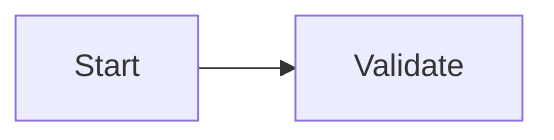

## Mermaid 2

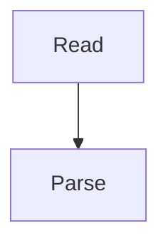

## Mermaid 3

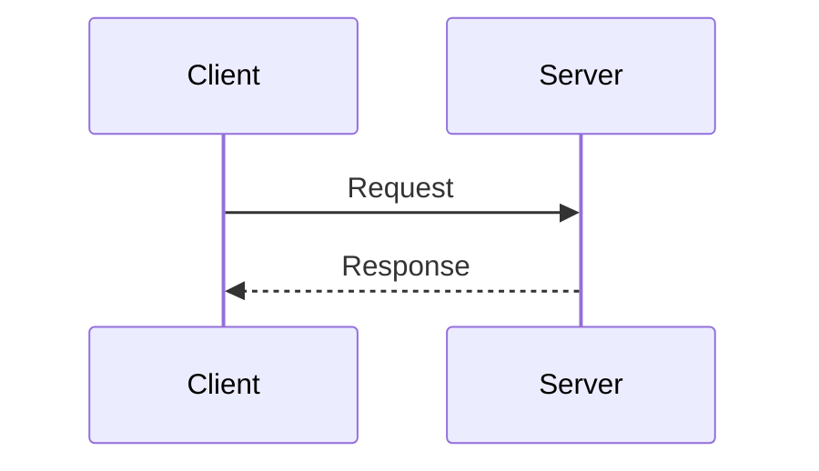

## Mermaid 4

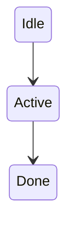

## Mermaid 5

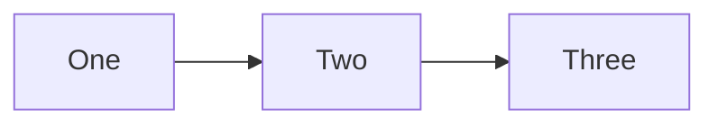

## PlantUML 1

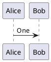

## PlantUML 2

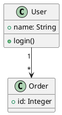

## PlantUML 3

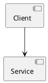

## PlantUML 4

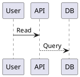

## PlantUML 5

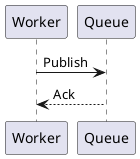

## Graphviz 1

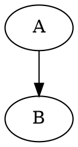

## Graphviz 2

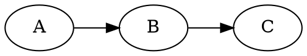

## Graphviz 3

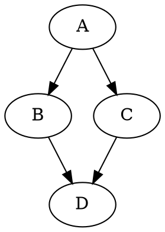

## Graphviz 4

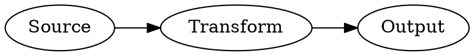

## Graphviz 5

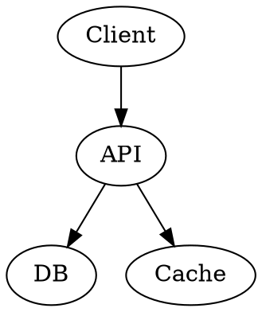

## Other rendering work

Inline math $\sqrt{x^2+y^2}$; block math:

$$
\sum_{i=1}^{10} i = 55
$$

```typescript
function pass(value: string): string { return value; }
```


| Kind | Count |
| --- | ---: |
| Mermaid | 5 |
| PlantUML | 5 |
| Graphviz | 5 |
