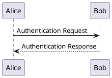
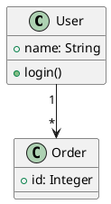
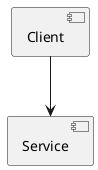
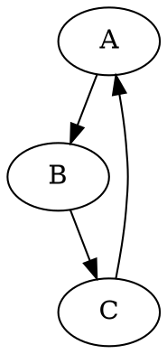
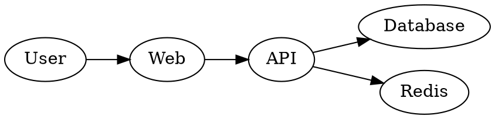
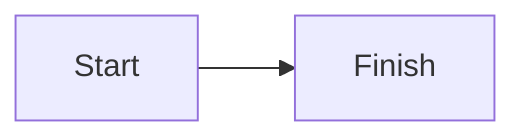

# Local diagram fixture

This document checks all bundled diagram renderers, formulas, code, local resources, tables, and links.

## PlantUML sequence



## PlantUML class



## PlantUML component



## Graphviz directed



## Graphviz left to right



## Mermaid



## Invalid PlantUML

```plantuml
@startuml
class Cache { +get() }
@enduml
```

## Invalid DOT

```dot
digraph G { A -> }
```

## Unavailable remote include

```plantuml
@startuml
!include https://example.invalid/missing.puml
Alice -> Bob
@enduml
```

## Other Markdown content

Inline math $x^2 + y^2 = z^2$ and display math:

$$
\frac{a}{b} < c
$$

```typescript
const message: string = "local rendering";
```


| Renderer | Runs locally |
| --- | --- |
| PlantUML | Yes |
| Graphviz | Yes |

[Back to the top](#local-diagram-fixture) · [Project repository](https://github.com/ytcheng/vscode-markdown-reader)
