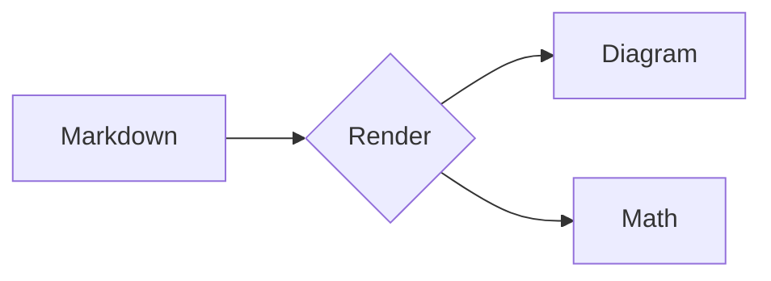
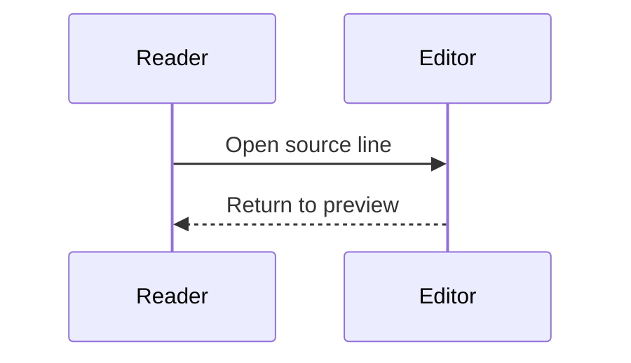

# V0.2 Reader

Double-click this **paragraph** to open its source line. Use Edit and # beside a heading to edit or copy its link.

## Shiki

```typescript
const answer: number = 42;
console.log(`Answer: ${answer}`);
```

```rust
fn main() {
    let message = "Offline highlighting";
    println!("{}", message);
}
```

## Mermaid





## KaTeX

Inline: $E = mc^2$. Escaped currency: \$5. Code: `$not math$`.

$$
\frac{a}{b} + \sqrt{x} = \sum_{i=0}^{n} i
$$

## Source blocks

- First item
- Second item with **formatting**

> Double-click this quote.

| Feature | Status |
| --- | --- |
| Source mapping | Ready |

## Error fallback

```mermaid
This is not a valid diagram
```

$\unknowncommand{x}$

The rest of the document remains readable.
